# Dokumentasi Aplikasi

Dokumentasi ini dibagi per bab dan subbab berdasarkan fitur, sesuai implementasi di project.

## Daftar Isi

1. [Bab 1 - Fitur Health API](#bab-1---fitur-health-api)
	1. [Penjelasan fitur](#11-penjelasan-fitur)
	2. [File yang dipakai](#12-file-yang-dipakai)
	3. [Kode yang dipakai](#13-kode-yang-dipakai)
	4. [Flowchart](#14-flowchart)
	5. [Class Diagram](#15-class-diagram)
2. [Bab 2 - Fitur Login API](#bab-2---fitur-login-api)
	1. [Penjelasan fitur](#21-penjelasan-fitur)
	2. [File yang dipakai](#22-file-yang-dipakai)
	3. [Kode yang dipakai](#23-kode-yang-dipakai)
	4. [Flowchart](#24-flowchart)
	5. [Class Diagram](#25-class-diagram)
3. [Bab 3 - Fitur Role API](#bab-3---fitur-role-api)
	1. [Penjelasan fitur](#31-penjelasan-fitur)
	2. [File yang dipakai](#32-file-yang-dipakai)
	3. [Kode yang dipakai](#33-kode-yang-dipakai)
	4. [Flowchart](#34-flowchart)
	5. [Class Diagram](#35-class-diagram)
4. [Bab 4 - Fitur Dashboard API](#bab-4---fitur-dashboard-api)
	1. [Penjelasan fitur](#41-penjelasan-fitur)
	2. [File yang dipakai](#42-file-yang-dipakai)
	3. [Kode yang dipakai](#43-kode-yang-dipakai)
	4. [Flowchart](#44-flowchart)
	5. [Class Diagram](#45-class-diagram)
5. [Bab 5 - Fitur Notifikasi API](#bab-5---fitur-notifikasi-api)
	1. [Penjelasan fitur](#51-penjelasan-fitur)
	2. [File yang dipakai](#52-file-yang-dipakai)
	3. [Kode yang dipakai](#53-kode-yang-dipakai)
	4. [Flowchart](#54-flowchart)
	5. [Class Diagram](#55-class-diagram)
6. [Bab 6 - Fitur Sinkronisasi Aksi Notifikasi (Scheduler)](#bab-6---fitur-sinkronisasi-aksi-notifikasi-scheduler)
	1. [Penjelasan fitur](#61-penjelasan-fitur)
	2. [File yang dipakai](#62-file-yang-dipakai)
	3. [Kode yang dipakai](#63-kode-yang-dipakai)
	4. [Flowchart](#64-flowchart)
	5. [Class Diagram](#65-class-diagram)
7. [Bab 7 - Catatan Testing](#bab-7---catatan-testing)
8. [Bab 8 - Fitur Profile API](#bab-8---fitur-profile-api)
	1. [Penjelasan fitur](#81-penjelasan-fitur)
	2. [File yang dipakai](#82-file-yang-dipakai)
	3. [Kode yang dipakai](#83-kode-yang-dipakai)
	4. [Flowchart](#84-flowchart)
	5. [Class Diagram](#85-class-diagram)
9. [Bab 9 - Fitur Approval Change Request Profile (Admin)](#bab-9---fitur-approval-change-request-profile-admin)
	1. [Penjelasan fitur](#91-penjelasan-fitur)
	2. [File yang dipakai](#92-file-yang-dipakai)
	3. [Kode yang dipakai](#93-kode-yang-dipakai)
	4. [Flowchart](#94-flowchart)
	5. [Class Diagram](#95-class-diagram)
10. [Bab 10 - Fitur Diklat API](#bab-10---fitur-diklat-api)
	1. [Penjelasan fitur](#101-penjelasan-fitur)
	2. [File yang dipakai](#102-file-yang-dipakai)
	3. [Kode yang dipakai](#103-kode-yang-dipakai)
	4. [Flowchart](#104-flowchart)
	5. [Class Diagram](#105-class-diagram)
11. [Bab 11 - Fitur Upload Foto Profile (Tanpa Approval)](#bab-11---fitur-upload-foto-profile-tanpa-approval)
	1. [Penjelasan fitur](#111-penjelasan-fitur)
	2. [File yang dipakai](#112-file-yang-dipakai)
	3. [Kode yang dipakai](#113-kode-yang-dipakai)
	4. [Flowchart](#114-flowchart)
	5. [Class Diagram](#115-class-diagram)
12. [Bab 12 - Fitur Riwayat Karir Pendidikan API](#bab-12---fitur-riwayat-karir-pendidikan-api)
	1. [Penjelasan fitur](#121-penjelasan-fitur)
	2. [File yang dipakai](#122-file-yang-dipakai)
	3. [Kode yang dipakai](#123-kode-yang-dipakai)
	4. [Flowchart](#124-flowchart)
	5. [Class Diagram](#125-class-diagram)
13. [Bab 13 - Fitur Riwayat Karir Jabatan API](#bab-13---fitur-riwayat-karir-jabatan-api)
	1. [Penjelasan fitur](#131-penjelasan-fitur)
	2. [File yang dipakai](#132-file-yang-dipakai)
	3. [Kode yang dipakai](#133-kode-yang-dipakai)
	4. [Flowchart](#134-flowchart)
	5. [Class Diagram](#135-class-diagram)
14. [Bab 14 - Fitur Riwayat Karir Pangkat API](#bab-14---fitur-riwayat-karir-pangkat-api)
	1. [Penjelasan fitur](#141-penjelasan-fitur)
	2. [File yang dipakai](#142-file-yang-dipakai)
	3. [Kode yang dipakai](#143-kode-yang-dipakai)
	4. [Flowchart](#144-flowchart)
	5. [Class Diagram](#145-class-diagram)
15. [Bab 15 - Fitur Riwayat Karir SIP API](#bab-15---fitur-riwayat-karir-sip-api)
	1. [Penjelasan fitur](#151-penjelasan-fitur)
	2. [File yang dipakai](#152-file-yang-dipakai)
	3. [Kode yang dipakai](#153-kode-yang-dipakai)
	4. [Flowchart](#154-flowchart)
	5. [Class Diagram](#155-class-diagram)
16. [Bab 16 - Fitur Riwayat Karir STR API](#bab-16---fitur-riwayat-karir-str-api)
	1. [Penjelasan fitur](#161-penjelasan-fitur)
	2. [File yang dipakai](#162-file-yang-dipakai)
	3. [Kode yang dipakai](#163-kode-yang-dipakai)
	4. [Flowchart](#164-flowchart)
	5. [Class Diagram](#165-class-diagram)
17. [Bab 17 - Fitur Riwayat Karir Penugasan Klinis API](#bab-17---fitur-riwayat-karir-penugasan-klinis-api)
	1. [Penjelasan fitur](#171-penjelasan-fitur)
	2. [File yang dipakai](#172-file-yang-dipakai)
	3. [Kode yang dipakai](#173-kode-yang-dipakai)
	4. [Flowchart](#174-flowchart)
	5. [Class Diagram](#175-class-diagram)
18. [Bab 18 - Fitur Pegawai API](#bab-18---fitur-pegawai-api)
	1. [Penjelasan fitur](#181-penjelasan-fitur)
	2. [File yang dipakai](#182-file-yang-dipakai)
	3. [Kode yang dipakai](#183-kode-yang-dipakai)
	4. [Flowchart](#184-flowchart)
	5. [Class Diagram](#185-class-diagram)
19. [Bab 19 - Fitur Generate CV API](#bab-19---fitur-generate-cv-api)
	1. [Penjelasan fitur](#191-penjelasan-fitur)
	2. [File yang dipakai](#192-file-yang-dipakai)
	3. [Kode yang dipakai](#193-kode-yang-dipakai)
	4. [Flowchart](#194-flowchart)
	5. [Class Diagram](#195-class-diagram)

---

## Bab 1 - Fitur Health API

### 1.1 Penjelasan Fitur

Endpoint `GET /api/health` dipakai untuk health check dasar agar client/devops bisa memastikan service API aktif.

### 1.2 File Yang Dipakai

1. `routes/api.php`

### 1.3 Kode Yang Dipakai

```php
Route::get('/health', function () {
	return response()->json([
		'success' => true,
		'message' => 'API is running',
		'data' => [
			'status' => 'up',
			'service' => config('app.name'),
			'timestamp' => now()->toISOString(),
		],
	]);
});
```

### 1.4 Flowchart

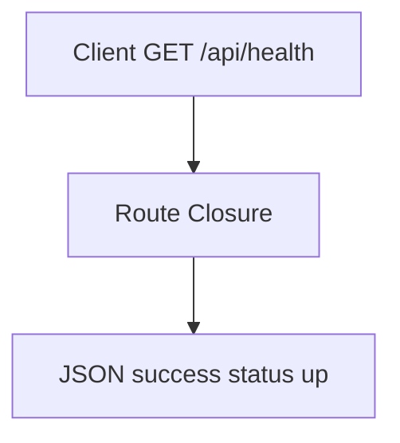

### 1.5 Class Diagram

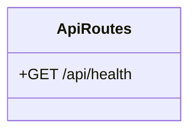

---

## Bab 2 - Fitur Login API

### 2.1 Penjelasan Fitur

Endpoint `POST /api/login` untuk autentikasi user menggunakan `nik` dan `password`, lalu menghasilkan JWT untuk akses endpoint protected.

### 2.2 File Yang Dipakai

1. `routes/api.php`
2. `app/Http/Controllers/Api/AuthController.php`
3. `app/Http/Requests/Auth/LoginRequest.php`
4. `app/Services/Auth/AuthService.php`
5. `app/Repositories/Auth/AuthRepository.php`
6. `app/Services/Security/JwtService.php`

### 2.3 Kode Yang Dipakai

```php
public function login(LoginRequest $request): JsonResponse
{
	$payload = $this->authService->login(
		$request->validated('nik'),
		$request->validated('password')
	);

	return response()->json([
		'success' => true,
		'message' => 'Login berhasil',
		'data' => $payload,
	]);
}
```

```php
$token = $this->jwtService->generate([
	'sub' => (string) $user->id,
	'nik' => $user->nik,
	'role' => $user->role,
]);
```

### 2.4 Flowchart

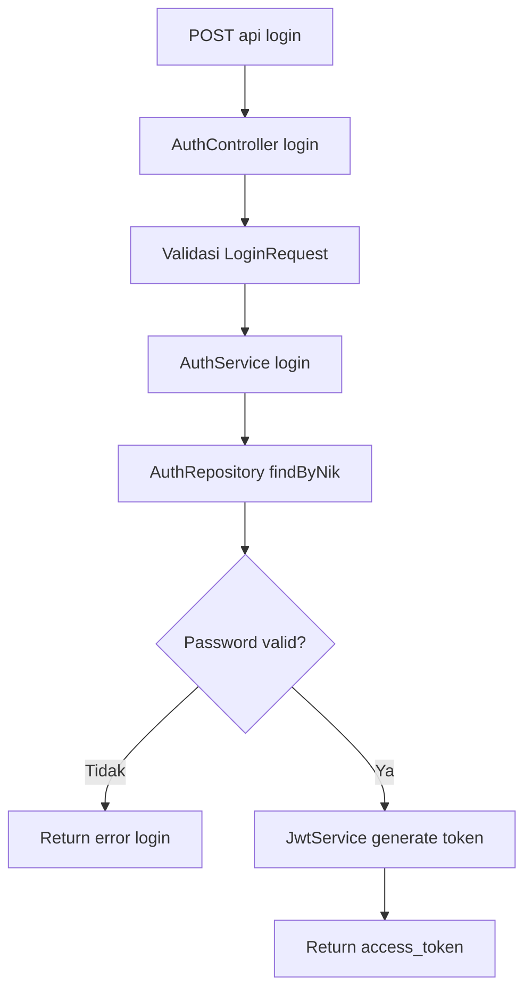

### 2.5 Class Diagram

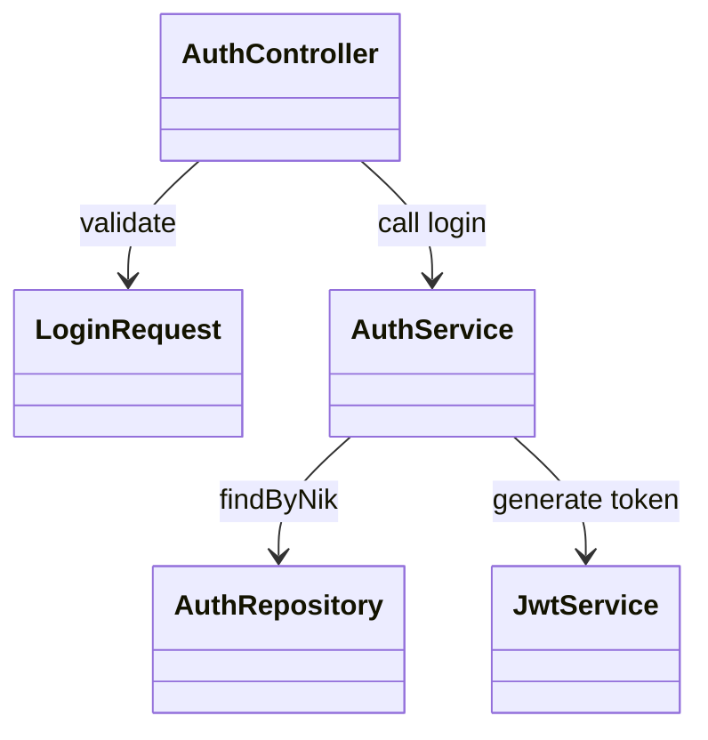

---

## Bab 3 - Fitur Role API

### 3.1 Penjelasan Fitur

Endpoint `GET /api/role` menampilkan role user login dan pesan sambutan berdasarkan role.

### 3.2 File Yang Dipakai

1. `routes/api.php`
2. `app/Http/Controllers/Api/RoleController.php`
3. `app/Http/Middleware/JwtAuthMiddleware.php`
4. `app/Http/Middleware/RoleMiddleware.php`

### 3.3 Kode Yang Dipakai

```php
Route::middleware(['jwt.auth', 'role:admin,pegawai,hrd,direktur'])
	->get('/role', [RoleController::class, 'show']);
```

```php
$claims = $request->attributes->get('_jwt_claims', []);
$role = strtolower((string) ($claims['role'] ?? ''));
```

### 3.4 Flowchart

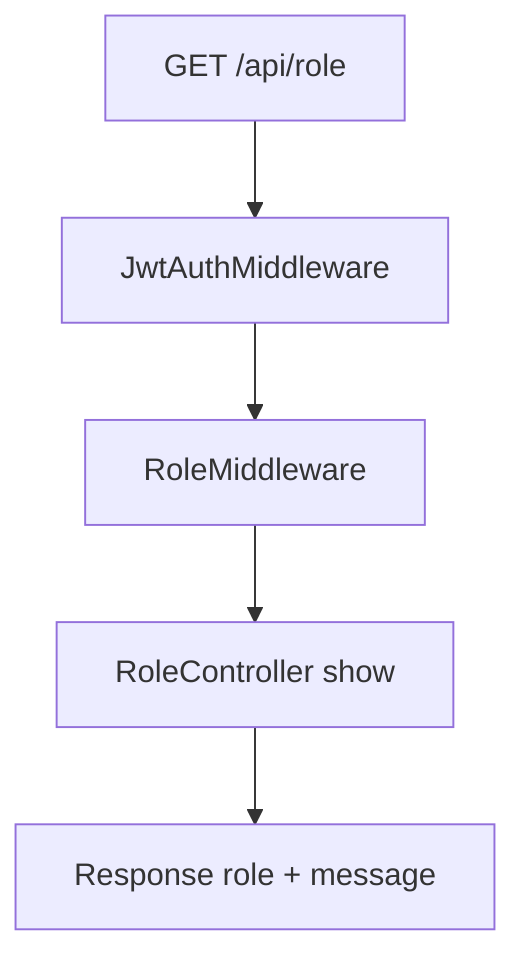

### 3.5 Class Diagram

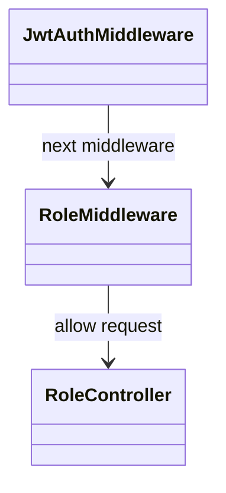

---

## Bab 4 - Fitur Dashboard API

### 4.1 Penjelasan Fitur

Endpoint `GET /api/dashboard` memberikan payload dashboard berdasarkan role. 

Untuk role `pegawai`, response berisi:

1. Ringkasan data pegawai (nama, nip, jabatan, unit kerja, dll).
2. Ringkasan diklat (selesai/belum selesai).
3. `list_aksi` dari notifikasi `type=action` yang belum resolved.
4. Notifikasi info dipisah ke endpoint `GET /api/notifications`.

Untuk role `admin`, response berisi ringkasan:

1. `jumlah_pegawai` (total seluruh pegawai)
2. `jumlah_pegawai_aktif` (total pegawai dengan status_pegawai aktif)
3. `jumlah_permintaan_update_data` (total seluruh pengajuan perubahan data)
4. `jumlah_permintaan_disetujui` (total pengajuan perubahan data yang disetujui)

### 4.2 File Yang Dipakai

1. `routes/api.php`
2. `app/Http/Controllers/Api/DashboardController.php`
3. `app/Services/Dashboard/DashboardService.php`
4. `app/Services/Dashboard/PegawaiService.php`
5. `app/Services/Dashboard/AdminService.php`
6. `app/Services/Dashboard/HrdService.php`
7. `app/Services/Dashboard/DirekturService.php`
8. `app/Repositories/Dashboard/PegawaiDashboardRepository.php`
9. `app/Repositories/Dashboard/AdminDashboardRepository.php`
10. `app/Services/Notification/NotificationActionSyncService.php`

### 4.3 Kode Yang Dipakai

```php
public function show(Request $request): JsonResponse
{
	$claims = $request->attributes->get('_jwt_claims', []);
	$payload = $this->dashboardService->getPayloadByRole($claims);

	return response()->json([
		'success' => true,
		'message' => 'Dashboard berhasil diambil',
		'data' => $payload,
	]);
}
```

```php
$this->notificationActionSyncService->syncDashboardActionsByUserId($userId);
$aksi = $this->repository->getActiveActionNotificationsForUser($userId);
```

### 4.4 Flowchart

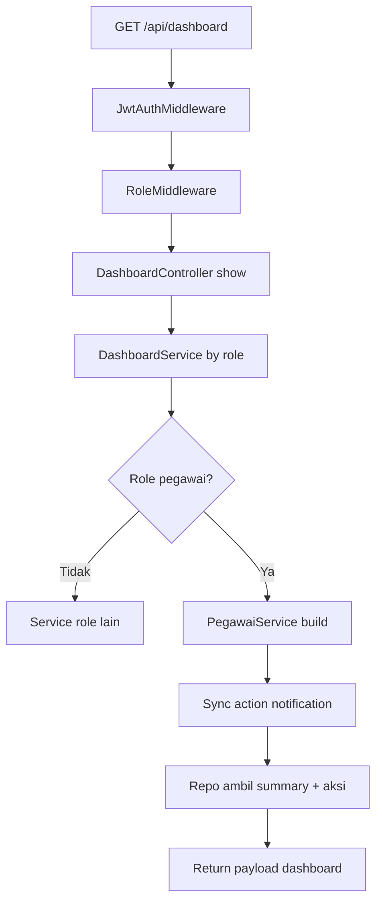

### 4.5 Class Diagram

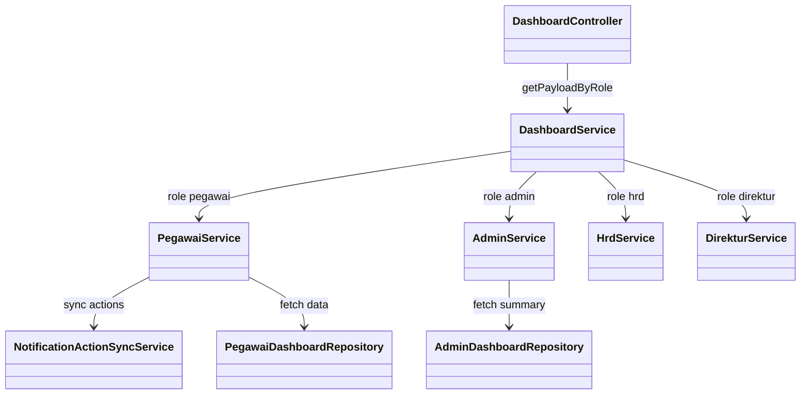

---

## Bab 5 - Fitur Notifikasi API

### 5.1 Penjelasan Fitur

Fitur notifikasi dipakai untuk:

1. Mengambil list notifikasi info unread milik user login.
2. Menandai 1 notifikasi sebagai read.
3. Menandai seluruh notifikasi unread user sebagai read.

Catatan route aktif saat ini:

1. `GET /api/notifications`
2. `PATCH /api/notifications/{id}/read`
3. `PATCH /api/notifications/read-all`

### 5.2 File Yang Dipakai

1. `routes/api.php`
2. `app/Http/Controllers/Api/NotificationController.php`
3. `app/Services/Notification/NotificationService.php`
4. `app/Repositories/Notification/NotificationRepository.php`
5. `app/Models/NotificationModel.php`

### 5.3 Kode Yang Dipakai

```php
Route::middleware(['jwt.auth'])->group(function () {
	Route::get('/notifications', [NotificationController::class, 'index']);
	Route::patch('/notifications/{id}/read', [NotificationController::class, 'markAsRead']);
	Route::patch('/notifications/read-all', [NotificationController::class, 'markAllAsRead']);
});
```

```php
$notification = $this->repository->findByIdAndUserId($notificationId, $userId);
if (! $notification) {
	throw new RuntimeException('Notifikasi tidak ditemukan.');
}

$this->repository->markAsRead($notification);
```

### 5.4 Flowchart

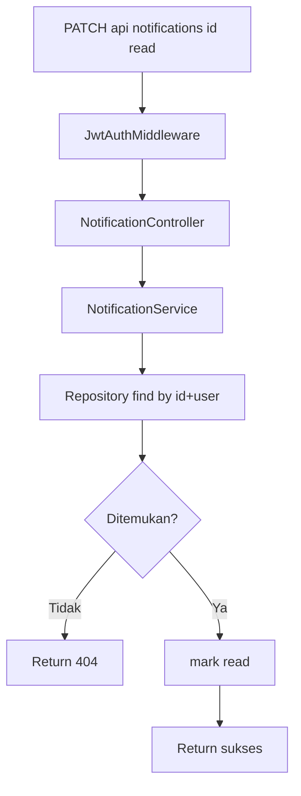

### 5.5 Class Diagram

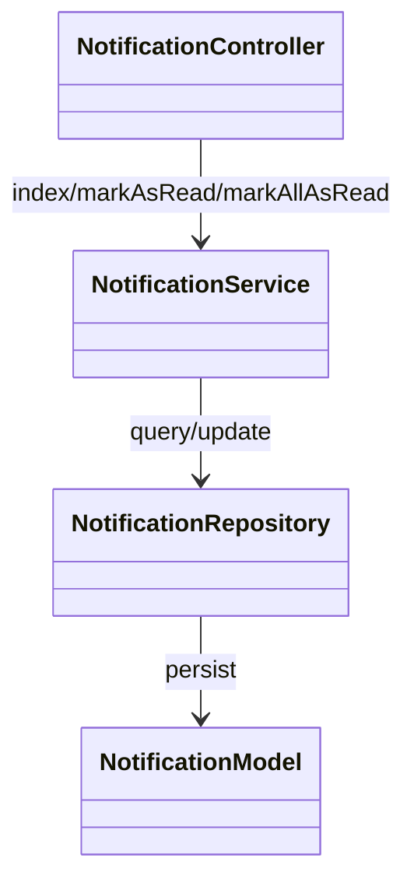

---

## Bab 6 - Fitur Sinkronisasi Aksi Notifikasi (Scheduler)

### 6.1 Penjelasan Fitur

Sinkronisasi aksi notifikasi memastikan `list_aksi` pada dashboard pegawai selalu mengikuti kondisi terbaru data pegawai.

Rule utama yang disinkronkan:

1. STR tidak ada / expired / akan expired (<= 90 hari).
2. Data keluarga belum lengkap.

Sinkronisasi dijalankan:

1. Saat dashboard pegawai dibuka (on-request sync).
2. Harian via scheduler command (batch).

### 6.2 File Yang Dipakai

1. `routes/console.php`
2. `app/Console/Commands/SyncDashboardNotificationActions.php`
3. `app/Services/Notification/NotificationActionSyncService.php`
4. `app/Repositories/Notification/NotificationRepository.php`
5. `database/migrations/2026_04_18_000100_add_action_fields_to_notification_table.php`
6. `database/migrations/2026_04_18_000200_make_notification_user_unique_key_unique.php`

### 6.3 Kode Yang Dipakai

```php
Schedule::command('notifications:sync-dashboard-actions --batch=50')
	->dailyAt('01:00')
	->withoutOverlapping();
```

```php
$this->notificationRepository->upsertActionNotification(
	userId: $userId,
	uniqueKey: $uniqueKey,
	title: $title,
	message: $message,
	actionCode: $actionCode,
	actionPayload: $payload
);

$this->notificationRepository->resolveMissingActionNotifications($userId, $activeUniqueKeys);
```

### 6.4 Flowchart

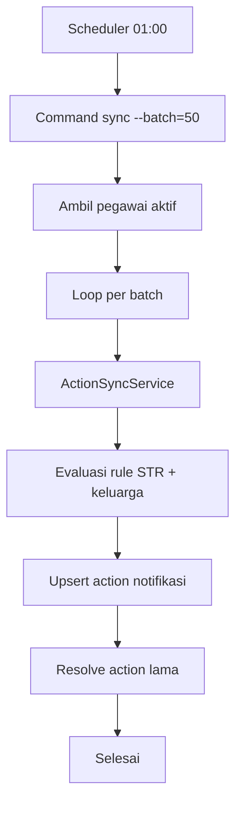

### 6.5 Class Diagram

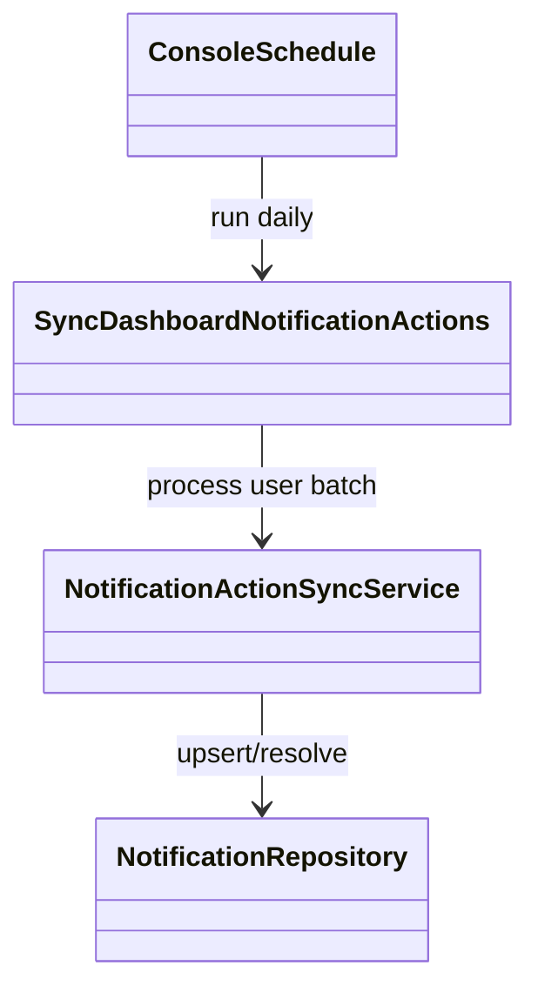

---

## Bab 7 - Catatan Testing

### 7.1 Testing Otomatis

1. `php artisan test` lulus.
2. `php artisan test tests/Feature/Api/NotificationActionLifecycleTest.php` lulus.

### 7.2 Testing Manual

1. `php artisan migrate:fresh --seed` sukses.
2. Smoke test dashboard pegawai menunjukkan aksi aktif berubah sesuai perubahan data.

### 7.3 Catatan Data Uji

1. Seeder menghasilkan user lintas role.
2. Seeder utama aktif berisi 4 akun role utama (admin, hrd, direktur, pegawai).
3. Seeder `BudiProfileChangeRequestSeeder` membuat 1 pengajuan profile `pending` milik Budi untuk simulasi approval admin.

---

## Bab 8 - Fitur Profile API

### 8.1 Penjelasan Fitur

Endpoint `GET /api/profile` dipakai untuk menampilkan data profil berdasarkan role login.

Untuk role `pegawai`, data profile saat ini sudah membaca data real dari tabel relasi pegawai, bukan dummy.

Field profile pegawai yang dikembalikan:

1. `nip`
2. `nik`
3. `nama`
4. `jenis_pegawai`
5. `profesi` (prioritas relasi `profesi_pegawai` dengan `is_current=true`)
6. `pendidikan_terakhir`
7. `unit_kerja` (didapat melalui relasi `jabatan_pegawai` -> `jabatan` -> `unit_kerja` dengan `is_current=true`)
8. `jk`
9. `tanggal_lahir`
10. `jabatan_sekarang` (prioritas relasi `jabatan_pegawai` dengan `is_current=true`)
11. `agama`
12. `status_kawin`
13. `alamat`
14. `no_telp`
15. `email`
16. `no_kk`
17. `link_kk`
18. `link_photo_profile`
19. `status_pegawai`
20. `tgl_masuk`
21. `pangkat` (prioritas relasi `pangkat_pegawai` dengan `is_current=true`)
22. `golongan_ruang` (prioritas relasi `golongan_ruang_pegawai` dengan `is_current=true`)
23. `tmt_cpns`
24. `tmt_pns`
25. `tmt_pangkat`
26. `masa_kerja` (hasil kalkulasi dari `tgl_masuk`)
27. `status_perubahan`
	1. `fitur` (fitur change request terbaru, contoh `profile`)
	2. `status` (status change request terbaru: `pending`/`approved`/`rejected`)
	3. `note` (catatan change request terbaru)
	4. `last_update` (waktu update terakhir data profile utama dan relasi current)

### 8.2 File Yang Dipakai

1. `routes/api.php`
2. `app/Http/Controllers/Api/ProfileController.php`
3. `app/Services/Profile/ProfileService.php`
4. `app/Services/Profile/PegawaiService.php`
5. `app/Services/Profile/AdminService.php`
6. `app/Services/Profile/HrdService.php`
7. `app/Services/Profile/DirekturService.php`
8. `app/Models/User.php`
9. `app/Models/Pegawai.php`
10. `app/Models/PegawaiPribadi.php`

### 8.3 Kode Yang Dipakai

```php
Route::middleware([
	JwtAuthMiddleware::class,
	RoleMiddleware::class.':admin,pegawai,hrd,direktur',
])->get('/profile', [ProfileController::class, 'show']);
```

```php
$payload = $this->profileService->getPayloadByRole($role, $userId);

return response()->json([
	'success' => true,
	'message' => $payload['welcome'],
	'data' => [
		'role' => $role,
		'profile' => $payload['summary'],
	],
]);
```

### 8.4 Flowchart

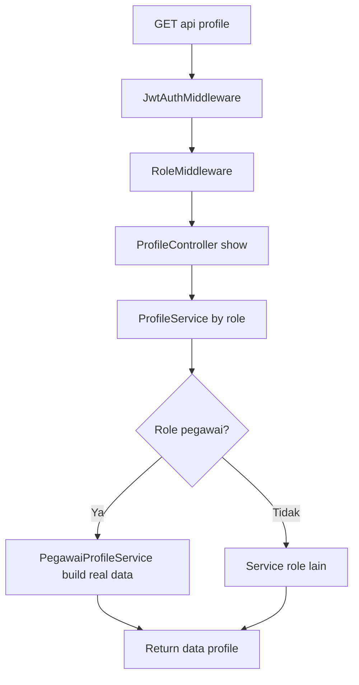

### 8.5 Class Diagram

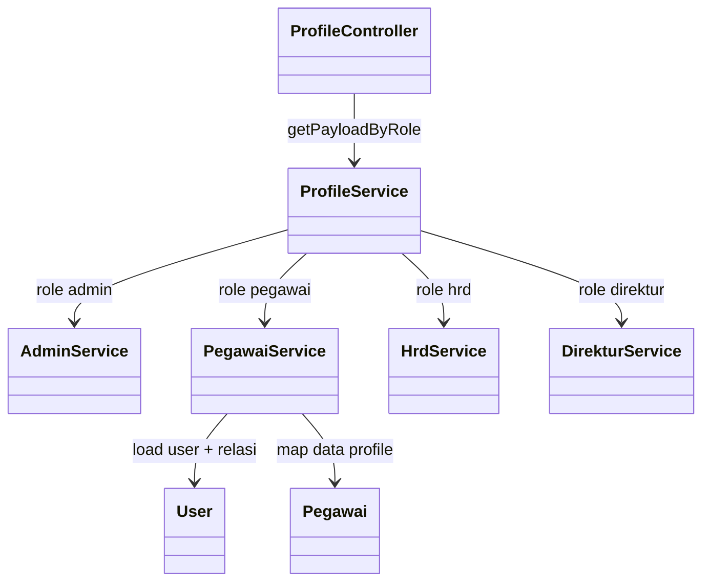

---

## Catatan Penamaan Endpoint

1. Dokumentasi bisnis sering menyebut `/api/notifikasi`.
2. Route implementasi saat ini adalah `/api/notifications`.
3. Jika diperlukan, dapat ditambahkan alias route `/api/notifikasi` tanpa mengubah route existing.

---

## Bab 9 - Fitur Approval Change Request Profile (Admin)

### 9.1 Penjelasan Fitur

Fitur ini dipakai untuk proses review pengajuan perubahan profile yang diajukan pegawai melalui endpoint `PATCH /api/profile`.

Alur utama:

1. Pegawai submit perubahan profile, sistem menyimpan ke `perubahan_data` (header) dan `detail_perubahan_data` (detail) dengan status `pending`.
2. Admin melihat daftar pengajuan dan detail pengajuan.
3. Admin memilih aksi:
	1. `accept`: status menjadi `approved` dan perubahan profile diaplikasikan ke tabel master (`pegawai` dan `pegawai_pribadi`).
	2. `reject`: status menjadi `rejected` tanpa mengubah tabel master.

### 9.2 File Yang Dipakai

1. `routes/api.php`
2. `app/Http/Controllers/Api/ChangeRequestAdminController.php`
3. `app/Services/ChangeRequest/ChangeRequestAdminService.php`
4. `app/Repositories/ChangeRequest/ChangeRequestRepository.php`
5. `app/Models/PerubahanData.php`
6. `app/Models/DetailPerubahanData.php`
7. `app/Models/Pegawai.php`
8. `app/Models/PegawaiPribadi.php`
9. `database/migrations/2026_04_19_000200_refactor_perubahan_data_table.php`
10. `database/migrations/2026_04_19_000300_create_detail_perubahan_data_table.php`
11. `database/seeders/BudiProfileChangeRequestSeeder.php`

### 9.3 Kode Yang Dipakai

```php
Route::middleware([
	JwtAuthMiddleware::class,
	RoleMiddleware::class.':admin',
])->prefix('admin')->group(function () {
	Route::get('/change-requests', [ChangeRequestAdminController::class, 'index']);
	Route::get('/change-requests/{id}', [ChangeRequestAdminController::class, 'show']);
	Route::patch('/change-requests/{id}/accept', [ChangeRequestAdminController::class, 'accept']);
	Route::patch('/change-requests/{id}/reject', [ChangeRequestAdminController::class, 'reject']);
});
```

```php
if ((string) $item->fitur === 'profile') {
	$this->applyProfileDetails($item);
}

$item->status = 'approved';
$item->note = $this->mergeAdminNote($item->note, 'APPROVED', $adminNote);
```

```php
$item->status = 'rejected';
$item->note = $this->mergeAdminNote($item->note, 'REJECTED', $adminNote);
```

### 9.4 Flowchart

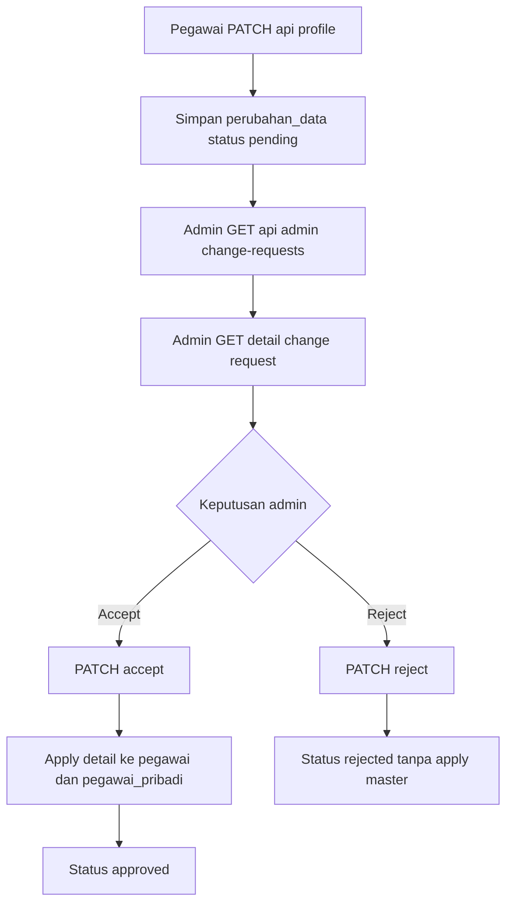

### 9.5 Class Diagram

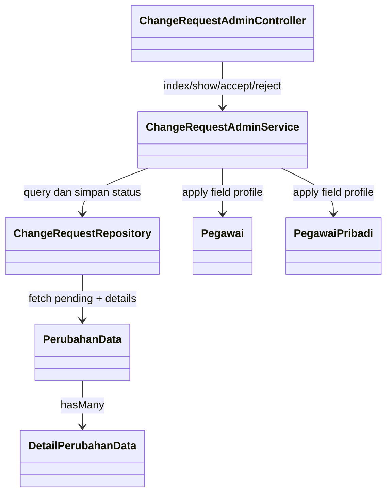

---

## Bab 10 - Fitur Diklat API

### 10.1 Penjelasan Fitur

Endpoint `GET /api/diklat` menampilkan data diklat berdasarkan role login.

Endpoint `POST /api/diklat` dipakai role `pegawai` untuk membuat data diklat baru.

Endpoint `PATCH /api/diklat/{id}` dipakai role `pegawai` untuk mengubah data diklat miliknya.

Endpoint `DELETE /api/diklat/{id}` dipakai role `pegawai` untuk menghapus data diklat miliknya dengan aturan status tertentu.

Pada implementasi saat ini, struktur payload antar role sudah dibedakan dan untuk role `pegawai` data sudah diambil dari database melalui repository.

1. `admin`: ringkasan total program dan list diklat institusi.
2. `pegawai`: ringkasan riwayat pribadi dan list riwayat diklat pegawai dari tabel `list_jadwal_diklat` + relasi `diklat`.
3. `hrd`: ringkasan usulan dan list usulan diklat per unit.
4. `direktur`: ringkasan anggaran dan list keputusan terbaru.

Aturan bisnis create (`POST /api/diklat`) role `pegawai`:

1. Jika `jenis_pelaksana = internal`:
	- `status_kelayakan` otomatis `layak`
	- `status_validasi` otomatis `null`
2. Jika `jenis_pelaksana = external`:
	- `jenis_biaya` otomatis `null`
	- `total_biaya` otomatis `null`
	- `status_kelayakan` otomatis `null`
	- `status_validasi` otomatis `null`

Aturan bisnis edit (`PATCH /api/diklat/{id}`) role `pegawai`:

1. `jenis_pelaksana` internal/external tidak bisa diubah.
2. Diklat `internal` yang `status_validasi = valid` tidak bisa diedit.
3. Diklat `external` yang `status_kelayakan = layak` tidak bisa diedit.
4. Diklat `internal` tetap `status_kelayakan = layak`, dengan `status_validasi` bisa `valid` atau `tidak valid`.
5. Diklat `external` tidak memerlukan validasi, sehingga `status_validasi`, `jenis_biaya`, dan `total_biaya` diset `null`.

Aturan bisnis delete (`DELETE /api/diklat/{id}`) role `pegawai`:

1. Boleh dihapus jika belum masuk kelayakan dan belum validasi.
2. Tidak boleh dihapus jika `status_kelayakan = layak` atau `status_validasi = valid`.

Field detail item diklat yang digunakan:

1. `nama`
2. `kategori`
3. `jenis`
4. `pelaksana`
5. `tanggal_mulai`
6. `tanggal_selesai`
7. `status` (hasil perhitungan by tanggal)
8. `tempat`
9. `waktu`
10. `created_by`
11. `jp`
12. `total_biaya`
13. `jenis_biaya`
14. `jenis_pelaksana`
15. `catatan`
16. `sertif_file_path`
17. `no_sertif`

Keterangan tambahan:

1. Role `pegawai` mengambil field detail dari data database.
2. Role `admin`, `hrd`, dan `direktur` saat ini masih dummy, namun detail item juga sudah mengembalikan field `catatan`.
3. Field `status` by tanggal saat ini digunakan pada detail item role `pegawai`.

Aturan `status` by tanggal:

1. `mendatang`: hari ini sebelum `tanggal_mulai`
2. `berlangsung`: hari ini di antara `tanggal_mulai` dan `tanggal_selesai`
3. `selesai`: hari ini setelah `tanggal_selesai`

### 10.2 File Yang Dipakai

1. `routes/api.php`
2. `app/Http/Controllers/Api/DiklatController.php`
3. `app/Services/Diklat/DiklatService.php`
4. `app/Services/Diklat/AdminService.php`
5. `app/Services/Diklat/PegawaiService.php`
6. `app/Services/Diklat/HrdService.php`
7. `app/Services/Diklat/DirekturService.php`
8. `app/Repositories/Diklat/PegawaiDiklatRepository.php`
9. `app/Http/Requests/Diklat/StorePegawaiDiklatRequest.php`
10. `app/Http/Requests/Diklat/UpdatePegawaiDiklatRequest.php`
11. `app/Models/Diklat.php`
12. `app/Models/ListJadwalDiklat.php`
13. `app/Models/JenisDiklat.php`
14. `app/Models/KategoriDiklat.php`
15. `app/Models/JenisBiaya.php`

### 10.3 Kode Yang Dipakai

```php
Route::middleware([
	JwtAuthMiddleware::class,
	RoleMiddleware::class.':admin,pegawai,hrd,direktur',
])->get('/diklat', [DiklatController::class, 'index']);
```

```php
$payload = $this->diklatService->getPayloadByRole($role, $userId);

return response()->json([
	'success' => true,
	'message' => $payload['welcome'],
	'data' => [
		'role' => $role,
		'diklat' => $payload['summary'],
	],
]);
```

### 10.4 Flowchart

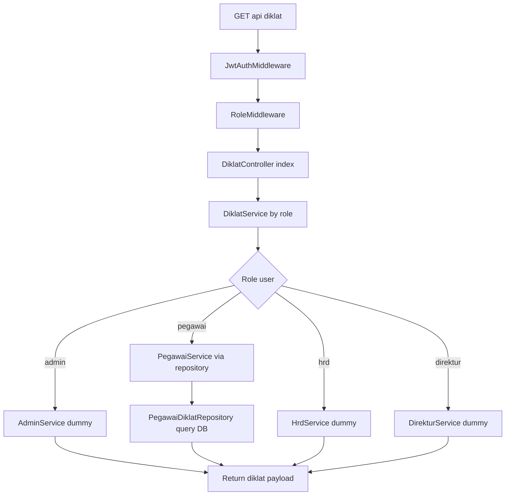

### 10.5 Class Diagram

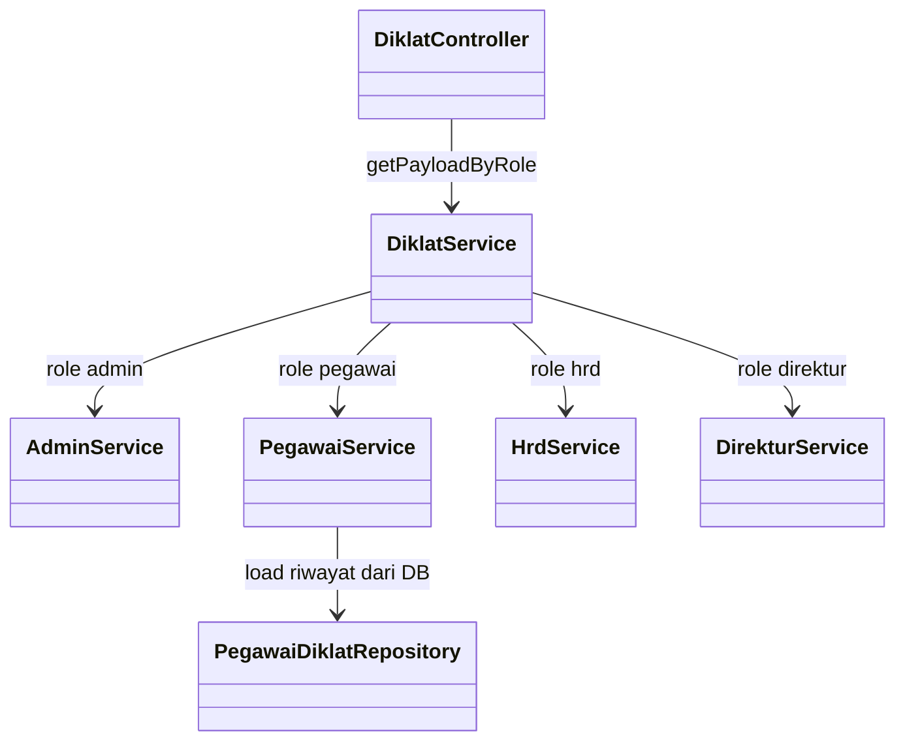

---

## Bab 11 - Fitur Upload Foto Profile (Tanpa Approval)

### 11.1 Penjelasan Fitur

Endpoint upload foto profile dipakai untuk update foto user login secara langsung tanpa melalui alur persetujuan admin.

Endpoint yang tersedia:

1. `POST /api/profil/profil-picture`
2. `POST /api/profile/profile-picture` (alias)
3. `POST /api/profil/ktp` (upload dokumen KTP)
4. `POST /api/profile/kk` (upload dokumen KK)

Karakteristik fitur:

1. Wajib upload file form-data dengan key `foto`.
2. Validasi file: `image`, ekstensi `jpg/jpeg/png/webp`, maksimal 2MB.
3. File disimpan ke folder publik `public/dokumen/foto`.
4. Kolom `pegawai_pribadi.foto_path` diperbarui langsung.
5. Foto lama lokal dihapus jika ada.
6. Endpoint KTP menyimpan file PDF ke `public/dokumen/ktp` dan mengisi `pegawai_pribadi.ktp_file_path`.
7. Endpoint KK menyimpan file PDF ke `public/dokumen/kk`, mengisi `pegawai_pribadi.kk_file_path`, dan `pegawai_pribadi.link_kk`.
8. Semua endpoint upload dokumen profile tidak membuat record `perubahan_data`.

### 11.2 File Yang Dipakai

1. `routes/api.php`
2. `app/Http/Controllers/Api/ProfileController.php`
3. `app/Http/Requests/Profile/UploadProfilePictureRequest.php`
4. `app/Http/Requests/Profile/UploadKtpFileRequest.php`
5. `app/Http/Requests/Profile/UploadKkFileRequest.php`
6. `app/Services/Profile/ProfileService.php`
7. `app/Models/PegawaiPribadi.php`

### 11.3 Kode Yang Dipakai

```php
Route::middleware([
	JwtAuthMiddleware::class,
	RoleMiddleware::class.':admin,pegawai,hrd,direktur',
])->post('/profil/profil-picture', [ProfileController::class, 'updateProfilePicture']);
```

```php
public function rules(): array
{
	return [
		'foto' => ['required', 'file', 'image', 'mimes:jpg,jpeg,png,webp', 'max:2048'],
	];
}
```

```php
$folder = public_path('dokumen/foto');
$file->move($folder, $filename);
$pribadi->foto_path = 'dokumen/foto/'.$filename;
$pribadi->save();
```

### 11.4 Flowchart

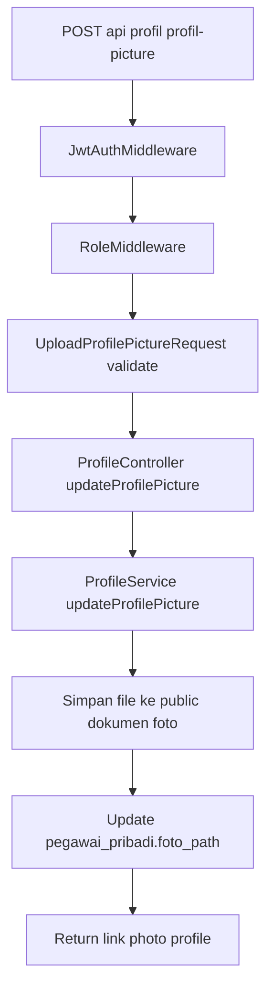

### 11.5 Class Diagram

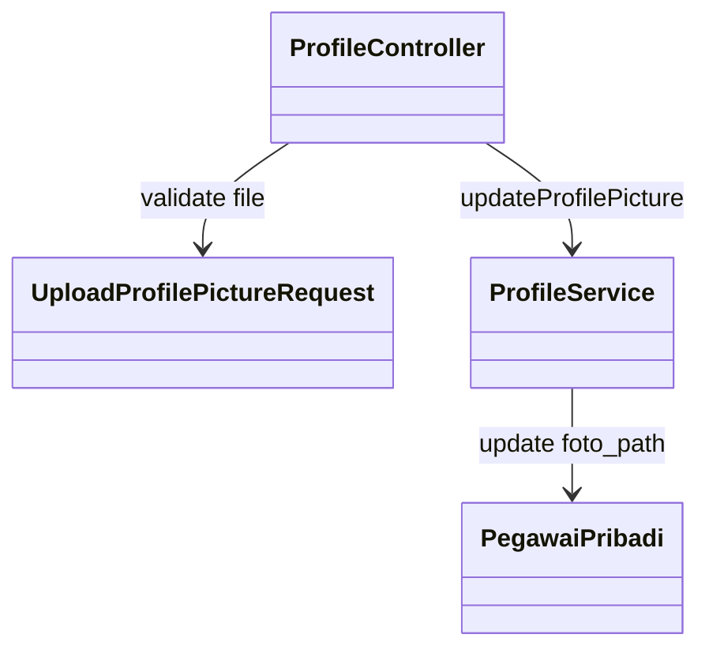

---

## Bab 12 - Fitur Riwayat Karir Pendidikan API

### 12.1 Penjelasan Fitur

Endpoint `GET /api/riwayat-karir/pendidikan` dipakai untuk menampilkan riwayat pendidikan milik user yang sedang login, diurutkan berdasarkan `tahun_lulus` menurun.

Endpoint `POST /api/riwayat-karir/pendidikan` dipakai untuk menambahkan data riwayat pendidikan baru milik user yang sedang login beserta dokumen ijazahnya.

Endpoint `PATCH /api/riwayat-karir/pendidikan/{id}` dipakai untuk mengubah data riwayat pendidikan yang sudah ada milik user yang sedang login.

Endpoint `DELETE /api/riwayat-karir/pendidikan/{id}` dipakai untuk menghapus data riwayat pendidikan beserta lampiran dokumen aslinya dari user yang sedang login.

Karakteristik fitur:

1. `GET` mengambil list pendidikan melalui `PendidikanRepository` dan melampirkan link_ijazah secara dinamis.
2. `POST` dan `PATCH` menerima `multipart/form-data` (untuk PATCH gunakan `_method=PATCH`).
3. Validasi input via `StorePendidikanRequest` (POST) dan `UpdatePendidikanRequest` (PATCH).
4. Jika file `ijazah` diupload, file akan disimpan ke `public/dokumen/ijazah` dan dicatat ke `ijazah_file_path` di tabel terkait. Jika pada `PATCH` sudah ada file lama, file lama akan dihapus dari *storage* lokal.
5. `DELETE` akan menghapus fisik file dari server jika data tersebut memilikinya, kemudian menghapus datanya dari database.

### 12.2 File Yang Dipakai

1. `routes/api.php`
2. `app/Http/Controllers/Api/RiwayatKarirController.php`
3. `app/Http/Requests/RiwayatKarir/StorePendidikanRequest.php`
4. `app/Http/Requests/RiwayatKarir/UpdatePendidikanRequest.php`
5. `app/Services/RiwayatKarir/PendidikanService.php`
6. `app/Repositories/RiwayatKarir/PendidikanRepository.php`

### 12.3 Kode Yang Dipakai

```php
Route::middleware([
	JwtAuthMiddleware::class,
	RoleMiddleware::class.':admin,pegawai,hrd,direktur',
])->get('/riwayat-karir/pendidikan', [RiwayatKarirController::class, 'pendidikan']);

Route::middleware([
	JwtAuthMiddleware::class,
	RoleMiddleware::class.':admin,pegawai,hrd,direktur',
])->post('/riwayat-karir/pendidikan', [RiwayatKarirController::class, 'storePendidikan']);

Route::middleware([
	JwtAuthMiddleware::class,
	RoleMiddleware::class.':admin,pegawai,hrd,direktur',
])->patch('/riwayat-karir/pendidikan/{id}', [RiwayatKarirController::class, 'updatePendidikan']);

Route::middleware([
	JwtAuthMiddleware::class,
	RoleMiddleware::class.':admin,pegawai,hrd,direktur',
])->delete('/riwayat-karir/pendidikan/{id}', [RiwayatKarirController::class, 'destroyPendidikan']);
```

```php
$result = $this->pendidikanService->updateByIdAndUserId(
	id: $id,
	userId: $userId,
	payload: $request->validated(),
	ijazahFile: $request->file('ijazah')
);
```

### 12.4 Flowchart

```mermaid
flowchart TD
	A[POST/PATCH/DELETE api/riwayat-karir/pendidikan] --> B[Controller Route]
	B --> C{Method?}
	C -- POST/PATCH --> D[FormRequest Validate]
	D --> E[PendidikanService create/update]
	E --> F{Ada file ijazah?}
	F -- Ya --> G[Simpan file ke public/dokumen/ijazah]
	F -- Tidak --> H[Lanjut]
	G --> H
	H --> I[PendidikanRepository simpan/update ke DB]
	I --> J[Return data]
	C -- DELETE --> K[PendidikanService delete]
	K --> L{Ada file ijazah lama?}
	L -- Ya --> M[Hapus fisik file]
	L -- Tidak --> N[Lanjut]
	M --> N
	N --> O[PendidikanRepository hapus dari DB]
	O --> J
```

### 12.5 Class Diagram

```mermaid
classDiagram
	class RiwayatKarirController
	class StorePendidikanRequest
	class UpdatePendidikanRequest
	class PendidikanService
	class PendidikanRepository

	RiwayatKarirController --> StorePendidikanRequest : validate (POST)
	RiwayatKarirController --> UpdatePendidikanRequest : validate (PATCH)
	RiwayatKarirController --> PendidikanService : get/create/update/delete
	PendidikanService --> PendidikanRepository : query/insert/update/delete
```

---

## Bab 13 - Fitur Riwayat Karir Jabatan API

### 13.1 Penjelasan Fitur

Endpoint CRUD riwayat jabatan memungkinkan user untuk:
1. `GET /api/riwayat-karir/jabatan` - Menampilkan daftar riwayat jabatannya secara urut berdasarkan tanggal mulai.
2. `POST /api/riwayat-karir/jabatan` - Menambahkan riwayat jabatan baru beserta unggahan file SK (Surat Keputusan).
3. `POST / PATCH /api/riwayat-karir/jabatan/{id}` - Mengupdate riwayat jabatan berdasarkan ID `jabatan_pegawai` (gunakan `POST` saat mengirim *multipart/form-data* untuk menghindari limitasi PHP).
4. `DELETE /api/riwayat-karir/jabatan/{id}` - Menghapus riwayat jabatan beserta file SK-nya.

Karakteristik fitur:
1. Data jabatan diambil dari relasi tabel `jabatan_pegawai` dan `jabatan`.
2. File SK disimpan di tabel `jabatan` (`sk_file_path`) dan disimpan secara fisik di folder `public/dokumen/jabatan`.
3. Pada saat penambahan data (`POST`), *Service* akan selalu membuat *record* `Jabatan` baru dan menghubungkannya dengan *record* `JabatanPegawai` baru. Hal ini diperlukan agar setiap jabatan yang ditambahkan memiliki data `sk_file_path` secara *independent* untuk pegawai tersebut.
4. Pada saat *update* atau *delete*, file SK lama akan otomatis dihapus (`unlink`) dari server.

### 13.2 File Yang Dipakai

1. `routes/api.php`
2. `app/Http/Controllers/Api/RiwayatKarirController.php`
3. `app/Services/RiwayatKarir/JabatanService.php`
4. `app/Repositories/RiwayatKarir/JabatanRepository.php`
5. `app/Http/Requests/RiwayatKarir/StoreJabatanRequest.php`
6. `app/Http/Requests/RiwayatKarir/UpdateJabatanRequest.php`

### 13.3 Kode Yang Dipakai

```php
Route::middleware([
	JwtAuthMiddleware::class,
	RoleMiddleware::class.':admin,pegawai,hrd,direktur',
])->get('/riwayat-karir/jabatan', [RiwayatKarirController::class, 'jabatan']);

Route::middleware([
	JwtAuthMiddleware::class,
	RoleMiddleware::class.':admin,pegawai,hrd,direktur',
])->post('/riwayat-karir/jabatan', [RiwayatKarirController::class, 'storeJabatan']);

Route::middleware([
	JwtAuthMiddleware::class,
	RoleMiddleware::class.':admin,pegawai,hrd,direktur',
])->patch('/riwayat-karir/jabatan/{id}', [RiwayatKarirController::class, 'updateJabatan']);

Route::middleware([
	JwtAuthMiddleware::class,
	RoleMiddleware::class.':admin,pegawai,hrd,direktur',
])->post('/riwayat-karir/jabatan/{id}', [RiwayatKarirController::class, 'updateJabatan']);

Route::middleware([
	JwtAuthMiddleware::class,
	RoleMiddleware::class.':admin,pegawai,hrd,direktur',
])->delete('/riwayat-karir/jabatan/{id}', [RiwayatKarirController::class, 'destroyJabatan']);
```

```php
$payload = $this->jabatanService->getByUserId($userId);
$result = $this->jabatanService->createByUserId(...);
$result = $this->jabatanService->updateByIdAndUserId(...);
$this->jabatanService->deleteByIdAndUserId($id, $userId);
```

### 13.4 Flowchart

```mermaid
flowchart TD
	A[GET/POST/PATCH/DELETE api/riwayat-karir/jabatan] --> B[Controller Route]
	B --> C{Method?}
	C -- GET --> D[JabatanService getByUserId]
	D --> E[JabatanRepository findPegawaiByUserIdWithJabatan]
	C -- POST/PATCH --> F[FormRequest Validate]
	F --> G[JabatanService create/update]
	G --> H{Ada file SK?}
	H -- Ya --> I[Simpan ke public/dokumen/jabatan]
	H -- Tidak --> J[Lanjut]
	I --> J
	J --> K[JabatanRepository create/update Jabatan & Pivot]
	C -- DELETE --> L[JabatanService delete]
	L --> M{Ada file SK lama?}
	M -- Ya --> N[Hapus fisik file]
	M -- Tidak --> O[Lanjut]
	N --> O
	O --> P[JabatanRepository delete Jabatan & Pivot]
```

### 13.5 Class Diagram

```mermaid
classDiagram
	class RiwayatKarirController
	class JabatanService
	class JabatanRepository
	class StoreJabatanRequest
	class UpdateJabatanRequest

	RiwayatKarirController --> StoreJabatanRequest : validate (POST)
	RiwayatKarirController --> UpdateJabatanRequest : validate (PATCH)
	RiwayatKarirController --> JabatanService : get/create/update/delete
	JabatanService --> JabatanRepository : query/insert/update/delete
```

---

## Bab 14 - Fitur Riwayat Karir Pangkat API

### 14.1 Penjelasan Fitur

Fitur ini memiliki fungsionalitas yang identik dengan Riwayat Jabatan dan Pendidikan, dimana relasi datanya melibatkan master `pangkat` dan pivot `pangkat_pegawai`. Endpoint yang disediakan:

1. `GET /api/riwayat-karir/pangkat`
2. `POST /api/riwayat-karir/pangkat` (mendukung unggah `sk_pangkat` ke folder `/public/dokumen/pangkat`)
3. `POST / PATCH /api/riwayat-karir/pangkat/{id}`
4. `DELETE /api/riwayat-karir/pangkat/{id}`

### 14.2 Penjelasan File dan Code

1. `StorePangkatRequest` & `UpdatePangkatRequest` bertugas memvalidasi input *form-data*, termasuk batas maksimum *file* 5MB.
2. `PangkatService` mengatur pembuatan *file upload* dan memanggil fungsi ke *repository*.
3. `PangkatRepository` menangani transaksi untuk tabel `pangkat` dan `pangkat_pegawai`.
4. Method di `RiwayatKarirController` mengatur penerimaan permintaan dari HTTP dan mengembalikannya sebagai respons JSON terstandarisasi.

### 14.3 Flowchart

```mermaid
graph TD
	A[User Request API] --> B{Method?}
	B -- GET --> C[Ambil data Riwayat Pangkat dari DB]
	C --> D[Return JSON Array]
	
	B -- POST/PATCH --> E[Validasi FormRequest]
	E --> F{Upload File?}
	F -- Ya --> G[Simpan di /public/dokumen/pangkat]
	F -- Tidak --> H[Abaikan]
	G --> I[PangkatRepository update DB]
	H --> I
	I --> J[Return JSON Success]
	
	B -- DELETE --> K[Cari PangkatPegawai ID]
	K --> L{Ada file SK lama?}
	L -- Ya --> M[Hapus fisik file]
	L -- Tidak --> N[Lanjut]
	M --> N
	N --> O[PangkatRepository delete Pivot & Master]
```

### 14.4 Class Diagram

```mermaid
classDiagram
	class RiwayatKarirController
	class PangkatService
	class PangkatRepository
	class StorePangkatRequest
	class UpdatePangkatRequest

	RiwayatKarirController --> StorePangkatRequest : validate (POST)
	RiwayatKarirController --> UpdatePangkatRequest : validate (PATCH)
	RiwayatKarirController --> PangkatService : get/create/update/delete
	PangkatService --> PangkatRepository : query/insert/update/delete
```

---

## Bab 15 - Fitur Riwayat Karir SIP API

### 15.1 Penjelasan Fitur

Fitur ini ditujukan untuk mengelola riwayat SIP (Surat Izin Praktik) tenaga medis. Berbeda dengan Jabatan atau Pangkat, relasi data SIP bersifat langsung (*one-to-many*) dari `pegawai` ke `sip` tanpa memerlukan tabel pivot. Endpoint yang disediakan:

1. `GET /api/riwayat-karir/sip`
2. `POST /api/riwayat-karir/sip` (mendukung unggah `sk_sip` ke folder `/public/dokumen/sip`)
3. `POST / PATCH /api/riwayat-karir/sip/{id}`
4. `DELETE /api/riwayat-karir/sip/{id}`

### 15.2 Penjelasan File dan Code

1. `StoreSipRequest` & `UpdateSipRequest` memvalidasi input *form-data*, termasuk batas maksimum lampiran *file* 5MB.
2. `SipService` menyimpan logika bisnis untuk menyimpan berkas file secara fisik ke direktori *public* dan mengembalikan *response* seragam.
3. `SipRepository` mengatur manipulasi langsung terhadap *Model* `Sip` di database.
4. Method di `RiwayatKarirController` mengatur _request HTTP_ CRUD.

### 15.3 Flowchart

```mermaid
graph TD
	A[User Request API] --> B{Method?}
	B -- GET --> C[Ambil data Riwayat SIP dari DB]
	C --> D[Return JSON Array]
	
	B -- POST/PATCH --> E[Validasi FormRequest]
	E --> F{Upload File?}
	F -- Ya --> G[Simpan di /public/dokumen/sip]
	F -- Tidak --> H[Abaikan]
	G --> I[SipRepository update DB]
	H --> I
	I --> J[Return JSON Success]
	
	B -- DELETE --> K[Cari SIP ID]
	K --> L{Ada file SK lama?}
	L -- Ya --> M[Hapus fisik file]
	L -- Tidak --> N[Lanjut]
	M --> N
	N --> O[SipRepository delete Sip]
```

### 15.4 Class Diagram

```mermaid
classDiagram
	class RiwayatKarirController
	class SipService
	class SipRepository
	class StoreSipRequest
	class UpdateSipRequest

	RiwayatKarirController --> StoreSipRequest : validate (POST)
	RiwayatKarirController --> UpdateSipRequest : validate (PATCH)
	RiwayatKarirController --> SipService : get/create/update/delete
	SipService --> SipRepository : query/insert/update/delete
```

---

## Bab 16 - Fitur Riwayat Karir STR API

### 16.1 Penjelasan Fitur

Fitur ini ditujukan untuk mengelola riwayat STR (Surat Tanda Registrasi) tenaga medis. Sama halnya seperti SIP, relasi datanya bersifat langsung (*one-to-many*) dari `pegawai` ke `str` tanpa memerlukan tabel pivot. Endpoint yang disediakan:

1. `GET /api/riwayat-karir/str`
2. `POST /api/riwayat-karir/str` (mendukung unggah `sk_str` ke folder `/public/dokumen/str`)
3. `POST / PATCH /api/riwayat-karir/str/{id}`
4. `DELETE /api/riwayat-karir/str/{id}`

### 16.2 Penjelasan File dan Code

1. `StoreStrRequest` & `UpdateStrRequest` memvalidasi input *form-data*, termasuk batas maksimum lampiran *file* 5MB.
2. `StrService` menyimpan logika bisnis untuk menyimpan berkas file secara fisik ke direktori *public* dan mengembalikan *response* seragam.
3. `StrRepository` mengatur manipulasi langsung terhadap *Model* `StrPegawai` di database.
4. Method di `RiwayatKarirController` mengatur _request HTTP_ CRUD.

### 16.3 Flowchart

```mermaid
graph TD
	A[User Request API] --> B{Method?}
	B -- GET --> C[Ambil data Riwayat STR dari DB]
	C --> D[Return JSON Array]
	
	B -- POST/PATCH --> E[Validasi FormRequest]
	E --> F{Upload File?}
	F -- Ya --> G[Simpan di /public/dokumen/str]
	F -- Tidak --> H[Abaikan]
	G --> I[StrRepository update DB]
	H --> I
	I --> J[Return JSON Success]
	
	B -- DELETE --> K[Cari STR ID]
	K --> L{Ada file SK lama?}
	L -- Ya --> M[Hapus fisik file]
	L -- Tidak --> N[Lanjut]
	M --> N
	N --> O[StrRepository delete STR]
```

### 16.4 Class Diagram

```mermaid
classDiagram
	class RiwayatKarirController
	class StrService
	class StrRepository
	class StoreStrRequest
	class UpdateStrRequest

	RiwayatKarirController --> StoreStrRequest : validate (POST)
	RiwayatKarirController --> UpdateStrRequest : validate (PATCH)
	RiwayatKarirController --> StrService : get/create/update/delete
	StrService --> StrRepository : query/insert/update/delete
```

---

## Bab 17 - Fitur Riwayat Karir Penugasan Klinis API

### 17.1 Penjelasan Fitur

Fitur ini ditujukan untuk mengelola riwayat penugasan klinis tenaga medis. Relasi datanya juga bersifat langsung (*one-to-many*) dari `pegawai` ke `penugasan_klinis` tanpa memerlukan tabel pivot. Endpoint yang disediakan:

1. `GET /api/riwayat-karir/penugasan-klinis`
2. `POST /api/riwayat-karir/penugasan-klinis` (mendukung unggah `dokumen_file` ke folder `/public/dokumen/penugasan-klinis`)
3. `POST / PATCH /api/riwayat-karir/penugasan-klinis/{id}`
4. `DELETE /api/riwayat-karir/penugasan-klinis/{id}`

### 17.2 Penjelasan File dan Code

1. `StorePenugasanKlinisRequest` & `UpdatePenugasanKlinisRequest` memvalidasi input *form-data*, termasuk batas maksimum lampiran *file* 5MB.
2. `PenugasanKlinisService` menyimpan logika bisnis untuk menyimpan berkas file secara fisik ke direktori *public* dan mengembalikan *response* seragam.
3. `PenugasanKlinisRepository` mengatur manipulasi langsung terhadap *Model* `PenugasanKlinis` di database.
4. Method di `RiwayatKarirController` mengatur _request HTTP_ CRUD.

### 17.3 Flowchart

```mermaid
graph TD
	A[User Request API] --> B{Method?}
	B -- GET --> C[Ambil data Riwayat Penugasan Klinis dari DB]
	C --> D[Return JSON Array]
	
	B -- POST/PATCH --> E[Validasi FormRequest]
	E --> F{Upload File?}
	F -- Ya --> G[Simpan di /public/dokumen/penugasan-klinis]
	F -- Tidak --> H[Abaikan]
	G --> I[PenugasanKlinisRepository update DB]
	H --> I
	I --> J[Return JSON Success]
	
	B -- DELETE --> K[Cari PK ID]
	K --> L{Ada file SK lama?}
	L -- Ya --> M[Hapus fisik file]
	L -- Tidak --> N[Lanjut]
	M --> N
	N --> O[PenugasanKlinisRepository delete PenugasanKlinis]
```

### 17.4 Class Diagram

```mermaid
classDiagram
	class RiwayatKarirController
	class PenugasanKlinisService
	class PenugasanKlinisRepository
	class StorePenugasanKlinisRequest
	class UpdatePenugasanKlinisRequest

	RiwayatKarirController --> StorePenugasanKlinisRequest : validate (POST)
	RiwayatKarirController --> UpdatePenugasanKlinisRequest : validate (PATCH)
	RiwayatKarirController --> PenugasanKlinisService : get/create/update/delete
	PenugasanKlinisService --> PenugasanKlinisRepository : query/insert/update/delete
```

---

## Bab 18 - Fitur Pegawai API

### 18.1 Penjelasan Fitur

Endpoint `GET /api/pegawai` digunakan oleh role `admin`, `hrd`, dan `direktur` untuk melihat daftar seluruh pegawai serta perhitungan ringkasan data (seperti total pegawai, jumlah dokter, perawat, dan variasi profesi).
Saat ini implementasi logik hanya dilakukan pada role `admin`, sedangkan role lainnya dikembalikan dengan data kosong (*dummy*).

### 18.2 File Yang Dipakai

1. `routes/api.php`
2. `app/Http/Controllers/Api/PegawaiController.php`
3. `app/Services/Pegawai/PegawaiService.php`
4. `app/Services/Pegawai/AdminPegawaiService.php`
5. `app/Services/Pegawai/HrdPegawaiService.php`
6. `app/Services/Pegawai/DirekturPegawaiService.php`
7. `app/Repositories/Pegawai/AdminPegawaiRepository.php`

### 18.3 Kode Yang Dipakai

```php
public function index(Request $request): JsonResponse
{
    $claims = $request->attributes->get('_jwt_claims', []);
    $role = strtolower((string) ($claims['role'] ?? ''));

    $payload = $this->pegawaiService->getPayloadByRole($role);

    return response()->json([
        'success' => true,
        'message' => 'Data pegawai berhasil diambil',
        'data' => $payload,
    ]);
}
```

### 18.4 Flowchart

```mermaid
flowchart TD
	A[GET /api/pegawai] --> B[JwtAuthMiddleware & RoleMiddleware]
	B --> C[PegawaiController index]
	C --> D[PegawaiService dispatcher]
	D --> E{Cek Role}
	E -- admin --> F[AdminPegawaiService]
	F --> G[AdminPegawaiRepository]
	G --> H[Hitung Statistik & Mapping]
	E -- hrd/direktur --> I[Hrd/DirekturPegawaiService]
	I --> J[Return Dummy]
	H --> K[Response Payload]
	J --> K
```

### 18.5 Class Diagram

```mermaid
classDiagram
	class PegawaiController
	class PegawaiService
	class AdminPegawaiService
	class HrdPegawaiService
	class DirekturPegawaiService
	class AdminPegawaiRepository

	PegawaiController --> PegawaiService : getPayloadByRole
	PegawaiService --> AdminPegawaiService : role admin
	PegawaiService --> HrdPegawaiService : role hrd
	PegawaiService --> DirekturPegawaiService : role direktur
	AdminPegawaiService --> AdminPegawaiRepository : fetch all pegawai
```

---

## Bab 19 - Fitur Generate CV API

### 19.1 Penjelasan Fitur

Endpoint `GET /api/generate/cv` digunakan oleh seluruh role untuk mendapatkan *payload JSON* terstruktur yang siap dipakai untuk membangun atau mencetak dokumen riwayat hidup (CV). Format outputnya disesuaikan dengan kebutuhan frontend (berisi sub-objek header, profil, data_diri, array pendidikan, dan array diklat). Khusus untuk role `admin`, `hrd`, dan `direktur`, terdapat dukungan parameter URL opsional `?pegawai_id={id}` untuk menarik CV pegawai tertentu selain dirinya sendiri.

### 19.2 File Yang Dipakai

1. `routes/api.php`
2. `app/Http/Controllers/Api/CvController.php`
3. `app/Services/Generate/CvService.php`
4. `app/Repositories/Generate/CvRepository.php`

### 19.3 Kode Yang Dipakai

```php
public function generateCvData(int $userId, string $role, ?int $requestedPegawaiId = null): array
{
    $pegawaiId = null;

    if ($requestedPegawaiId !== null && in_array($role, ['admin', 'hrd', 'direktur'], true)) {
        $pegawaiId = $requestedPegawaiId;
    } else {
        $pegawaiId = $this->cvRepository->getPegawaiIdByUserId($userId);
    }

    if (!$pegawaiId) {
        throw new ModelNotFoundException('Data pegawai tidak ditemukan.');
    }

    $pegawai = $this->cvRepository->getPegawaiForCv($pegawaiId);
    // Logika pemetaan data, kalkulasi usia masa kerja, dan validasi null...
    return [ 'header' => [...], 'profil' => [...], ... ];
}
```

### 19.4 Flowchart

```mermaid
flowchart TD
	A[GET /api/generate/cv?pegawai_id=] --> B[CvController]
	B --> C[Ekstrak ID & Role JWT]
	C --> D[Panggil CvService generateCvData]
	D --> E{Apakah request_pegawai_id ada \ndan Role = Admin/HRD/Dir?}
	E -- Ya --> F[Gunakan request_pegawai_id]
	E -- Tidak --> G[Ambil pegawai_id login]
	F --> H[CvRepository getPegawaiForCv]
	G --> H
	H --> I[Eager Load Relasi Pegawai]
	I --> J[Kalkulasi Masa Kerja dgn Carbon]
	J --> K[Pemetaan Mapping JSON]
	K --> L[Return JSON Berisi CV]
```

### 19.5 Class Diagram

```mermaid
classDiagram
	class CvController
	class CvService
	class CvRepository
	class Pegawai
	
	CvController --> CvService : generateCvData(userId, role, requestedPegawaiId)
	CvService --> CvRepository : getPegawaiIdByUserId
	CvService --> CvRepository : getPegawaiForCv
	CvRepository --> Pegawai : Eager Load Relasi
```

