# Dokumentasi Aplikasi

Dokumentasi ini dibagi per bab dan subbab berdasarkan fitur, sesuai implementasi di project.

## Daftar Isi

1. [Bab 1 - Fitur Health API](#bab-1---fitur-health-api)
	1. [Penjelasan fitur](#11-penjelasan-fitur)
	2. [File yang dipakai](#12-file-yang-dipakai)
	3. [Kode yang dipakai](#13-kode-yang-dipakai)
	4. [Flowchart](#14-flowchart)
	5. [Class Diagram](#15-class-diagram)
2. [Bab 2 - Fitur Login API](#bab-2---fitur-login-api)
	1. [Penjelasan fitur](#21-penjelasan-fitur)
	2. [File yang dipakai](#22-file-yang-dipakai)
	3. [Kode yang dipakai](#23-kode-yang-dipakai)
	4. [Flowchart](#24-flowchart)
	5. [Class Diagram](#25-class-diagram)
3. [Bab 3 - Fitur Role API](#bab-3---fitur-role-api)
	1. [Penjelasan fitur](#31-penjelasan-fitur)
	2. [File yang dipakai](#32-file-yang-dipakai)
	3. [Kode yang dipakai](#33-kode-yang-dipakai)
	4. [Flowchart](#34-flowchart)
	5. [Class Diagram](#35-class-diagram)
4. [Bab 4 - Fitur Dashboard API](#bab-4---fitur-dashboard-api)
	1. [Penjelasan fitur](#41-penjelasan-fitur)
	2. [File yang dipakai](#42-file-yang-dipakai)
	3. [Kode yang dipakai](#43-kode-yang-dipakai)
	4. [Flowchart](#44-flowchart)
	5. [Class Diagram](#45-class-diagram)
5. [Bab 5 - Fitur Notifikasi API](#bab-5---fitur-notifikasi-api)
	1. [Penjelasan fitur](#51-penjelasan-fitur)
	2. [File yang dipakai](#52-file-yang-dipakai)
	3. [Kode yang dipakai](#53-kode-yang-dipakai)
	4. [Flowchart](#54-flowchart)
	5. [Class Diagram](#55-class-diagram)
6. [Bab 6 - Fitur Sinkronisasi Aksi Notifikasi (Scheduler)](#bab-6---fitur-sinkronisasi-aksi-notifikasi-scheduler)
	1. [Penjelasan fitur](#61-penjelasan-fitur)
	2. [File yang dipakai](#62-file-yang-dipakai)
	3. [Kode yang dipakai](#63-kode-yang-dipakai)
	4. [Flowchart](#64-flowchart)
	5. [Class Diagram](#65-class-diagram)
7. [Bab 7 - Catatan Testing](#bab-7---catatan-testing)
8. [Bab 8 - Fitur Profile API](#bab-8---fitur-profile-api)
	1. [Penjelasan fitur](#81-penjelasan-fitur)
	2. [File yang dipakai](#82-file-yang-dipakai)
	3. [Kode yang dipakai](#83-kode-yang-dipakai)
	4. [Flowchart](#84-flowchart)
	5. [Class Diagram](#85-class-diagram)
9. [Bab 9 - Fitur Approval Change Request Profile (Admin)](#bab-9---fitur-approval-change-request-profile-admin)
	1. [Penjelasan fitur](#91-penjelasan-fitur)
	2. [File yang dipakai](#92-file-yang-dipakai)
	3. [Kode yang dipakai](#93-kode-yang-dipakai)
	4. [Flowchart](#94-flowchart)
	5. [Class Diagram](#95-class-diagram)
10. [Bab 10 - Fitur Diklat API](#bab-10---fitur-diklat-api)
	1. [Penjelasan fitur](#101-penjelasan-fitur)
	2. [File yang dipakai](#102-file-yang-dipakai)
	3. [Kode yang dipakai](#103-kode-yang-dipakai)
	4. [Flowchart](#104-flowchart)
	5. [Class Diagram](#105-class-diagram)
11. [Bab 11 - Fitur Upload Foto Profile (Tanpa Approval)](#bab-11---fitur-upload-foto-profile-tanpa-approval)
	1. [Penjelasan fitur](#111-penjelasan-fitur)
	2. [File yang dipakai](#112-file-yang-dipakai)
	3. [Kode yang dipakai](#113-kode-yang-dipakai)
	4. [Flowchart](#114-flowchart)
	5. [Class Diagram](#115-class-diagram)

---

## Bab 1 - Fitur Health API

### 1.1 Penjelasan Fitur

Endpoint `GET /api/health` dipakai untuk health check dasar agar client/devops bisa memastikan service API aktif.

### 1.2 File Yang Dipakai

1. `routes/api.php`

### 1.3 Kode Yang Dipakai

```php
Route::get('/health', function () {
	return response()->json([
		'success' => true,
		'message' => 'API is running',
		'data' => [
			'status' => 'up',
			'service' => config('app.name'),
			'timestamp' => now()->toISOString(),
		],
	]);
});
```

### 1.4 Flowchart

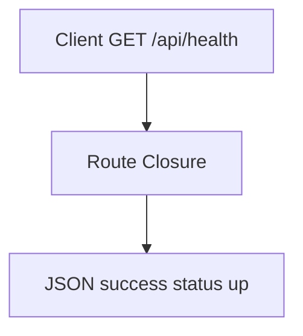
```mermaid
flowchart TD
	A[Client GET /api/health] --> B[Route Closure]
	B --> C[JSON success status up]
```

### 1.5 Class Diagram

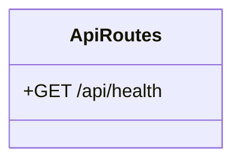
```mermaid
classDiagram
		class ApiRoutes {
			+GET /api/health
		}
```

---

## Bab 2 - Fitur Login API

### 2.1 Penjelasan Fitur

Endpoint `POST /api/login` untuk autentikasi user menggunakan `nik` dan `password`, lalu menghasilkan JWT untuk akses endpoint protected.

### 2.2 File Yang Dipakai

1. `routes/api.php`
2. `app/Http/Controllers/Api/AuthController.php`
3. `app/Http/Requests/Auth/LoginRequest.php`
4. `app/Services/Auth/AuthService.php`
5. `app/Repositories/Auth/AuthRepository.php`
6. `app/Services/Security/JwtService.php`

### 2.3 Kode Yang Dipakai

```php
public function login(LoginRequest $request): JsonResponse
{
	$payload = $this->authService->login(
		$request->validated('nik'),
		$request->validated('password')
	);

	return response()->json([
		'success' => true,
		'message' => 'Login berhasil',
		'data' => $payload,
	]);
}
```

```php
$token = $this->jwtService->generate([
	'sub' => (string) $user->id,
	'nik' => $user->nik,
	'role' => $user->role,
]);
```

### 2.4 Flowchart

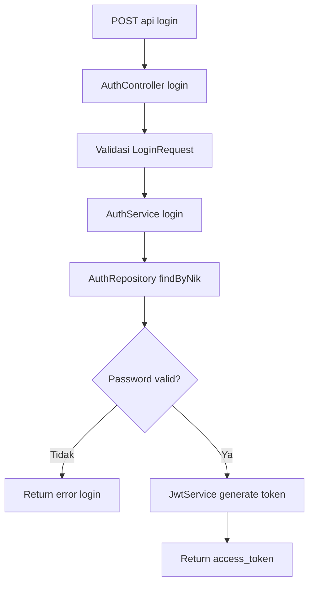
```mermaid
flowchart TD
	A[POST api login] --> B[AuthController login]
	B --> C[Validasi LoginRequest]
	C --> D[AuthService login]
	D --> E[AuthRepository findByNik]
	E --> F{Password valid?}
	F -- Tidak --> G[Return error login]
	F -- Ya --> H[JwtService generate token]
	H --> I[Return access_token]
```

### 2.5 Class Diagram

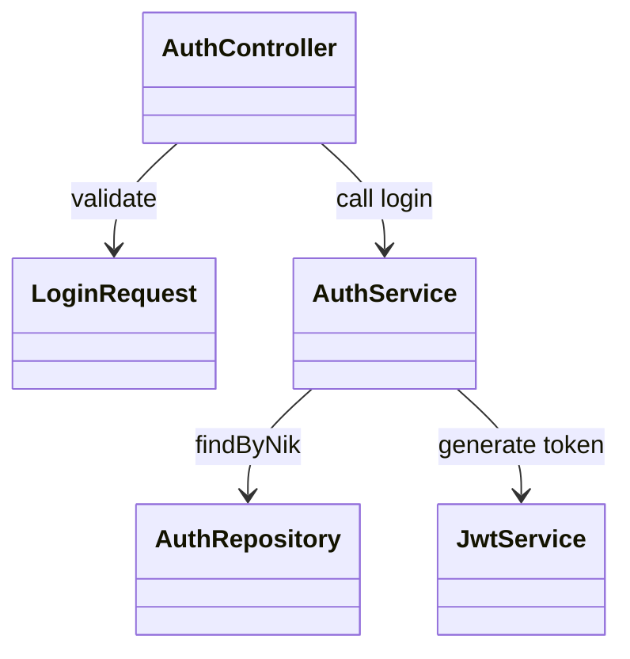
```mermaid
classDiagram
	class AuthController
	class LoginRequest
	class AuthService
	class AuthRepository
	class JwtService

	AuthController --> LoginRequest : validate
	AuthController --> AuthService : call login
	AuthService --> AuthRepository : findByNik
	AuthService --> JwtService : generate token
```

---

## Bab 3 - Fitur Role API

### 3.1 Penjelasan Fitur

Endpoint `GET /api/role` menampilkan role user login dan pesan sambutan berdasarkan role.

### 3.2 File Yang Dipakai

1. `routes/api.php`
2. `app/Http/Controllers/Api/RoleController.php`
3. `app/Http/Middleware/JwtAuthMiddleware.php`
4. `app/Http/Middleware/RoleMiddleware.php`

### 3.3 Kode Yang Dipakai

```php
Route::middleware(['jwt.auth', 'role:admin,pegawai,hrd,direktur'])
	->get('/role', [RoleController::class, 'show']);
```

```php
$claims = $request->attributes->get('_jwt_claims', []);
$role = strtolower((string) ($claims['role'] ?? ''));
```

### 3.4 Flowchart

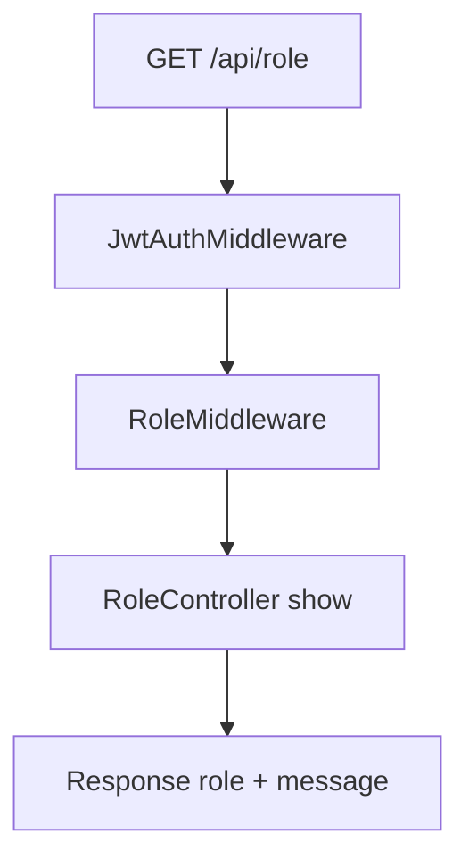
```mermaid
flowchart TD
	A[GET /api/role] --> B[JwtAuthMiddleware]
	B --> C[RoleMiddleware]
	C --> D[RoleController show]
	D --> E[Response role + message]
```

### 3.5 Class Diagram

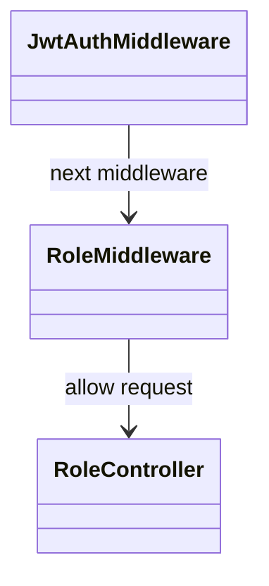
```mermaid
classDiagram
	class RoleController
	class JwtAuthMiddleware
	class RoleMiddleware

	JwtAuthMiddleware --> RoleMiddleware : next middleware
	RoleMiddleware --> RoleController : allow request
```

---

## Bab 4 - Fitur Dashboard API

### 4.1 Penjelasan Fitur

Endpoint `GET /api/dashboard` memberikan payload dashboard berdasarkan role. Untuk role `pegawai`, response berisi:

1. Ringkasan data pegawai (nama, nip, jabatan, unit kerja, dll).
2. Ringkasan diklat (selesai/belum selesai).
3. `list_notifikasi` dari notifikasi `type=info` yang unread.
4. `list_aksi` dari notifikasi `type=action` yang belum resolved.

### 4.2 File Yang Dipakai

1. `routes/api.php`
2. `app/Http/Controllers/Api/DashboardController.php`
3. `app/Services/Dashboard/DashboardService.php`
4. `app/Services/Dashboard/PegawaiService.php`
5. `app/Services/Dashboard/AdminService.php`
6. `app/Services/Dashboard/HrdService.php`
7. `app/Services/Dashboard/DirekturService.php`
8. `app/Repositories/Dashboard/PegawaiDashboardRepository.php`
9. `app/Services/Notification/NotificationActionSyncService.php`

### 4.3 Kode Yang Dipakai

```php
public function show(Request $request): JsonResponse
{
	$claims = $request->attributes->get('_jwt_claims', []);
	$payload = $this->dashboardService->getPayloadByRole($claims);

	return response()->json([
		'success' => true,
		'message' => 'Dashboard berhasil diambil',
		'data' => $payload,
	]);
}
```

```php
$this->notificationActionSyncService->syncDashboardActionsByUserId($userId);
$aksi = $this->repository->getActiveActionNotificationsForUser($userId);
$notifikasi = $this->repository->getUnreadInfoNotificationsForUser($userId);
```

### 4.4 Flowchart

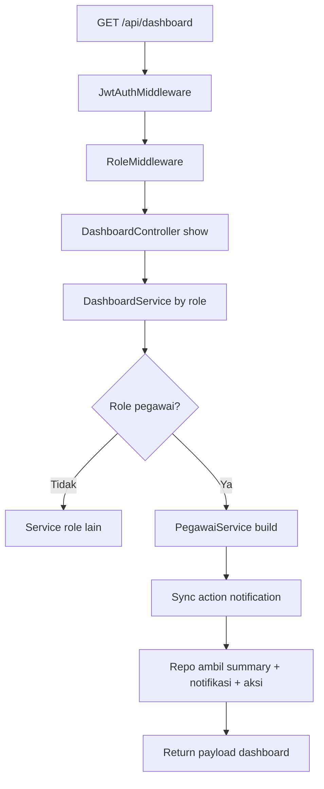
```mermaid
flowchart TD
	A[GET /api/dashboard] --> B[JwtAuthMiddleware]
	B --> C[RoleMiddleware]
	C --> D[DashboardController show]
	D --> E[DashboardService by role]
	E --> F{Role pegawai?}
	F -- Tidak --> G[Service role lain]
	F -- Ya --> H[PegawaiService build]
	H --> I[Sync action notification]
	I --> J[Repo ambil summary + notifikasi + aksi]
	J --> K[Return payload dashboard]
```

### 4.5 Class Diagram

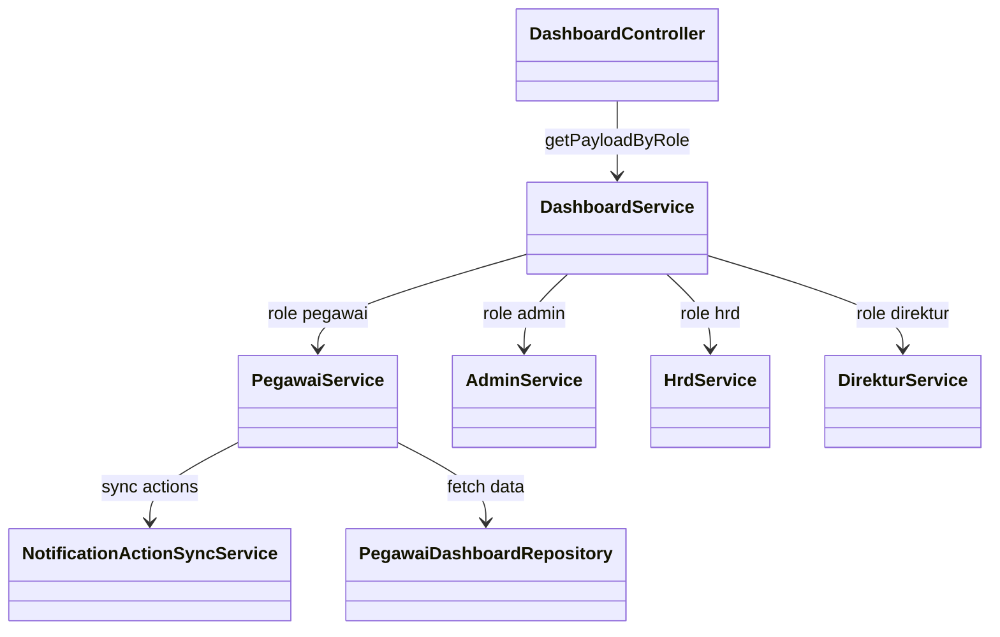
```mermaid
classDiagram
	class DashboardController
	class DashboardService
	class PegawaiService
	class AdminService
	class HrdService
	class DirekturService
	class PegawaiDashboardRepository
	class NotificationActionSyncService

	DashboardController --> DashboardService : getPayloadByRole
	DashboardService --> PegawaiService : role pegawai
	DashboardService --> AdminService : role admin
	DashboardService --> HrdService : role hrd
	DashboardService --> DirekturService : role direktur
	PegawaiService --> NotificationActionSyncService : sync actions
	PegawaiService --> PegawaiDashboardRepository : fetch data
```

---

## Bab 5 - Fitur Notifikasi API

### 5.1 Penjelasan Fitur

Fitur notifikasi read dipakai untuk:

1. Menandai 1 notifikasi sebagai read.
2. Menandai seluruh notifikasi unread user sebagai read.

Catatan route aktif saat ini:

1. `PATCH /api/notifications/{id}/read`
2. `PATCH /api/notifications/read-all`

### 5.2 File Yang Dipakai

1. `routes/api.php`
2. `app/Http/Controllers/Api/NotificationController.php`
3. `app/Services/Notification/NotificationService.php`
4. `app/Repositories/Notification/NotificationRepository.php`
5. `app/Models/NotificationModel.php`

### 5.3 Kode Yang Dipakai

```php
Route::middleware(['jwt.auth'])->group(function () {
	Route::patch('/notifications/{id}/read', [NotificationController::class, 'markAsRead']);
	Route::patch('/notifications/read-all', [NotificationController::class, 'markAllAsRead']);
});
```

```php
$notification = $this->repository->findByIdAndUserId($notificationId, $userId);
if (! $notification) {
	throw new RuntimeException('Notifikasi tidak ditemukan.');
}

$this->repository->markAsRead($notification);
```

### 5.4 Flowchart

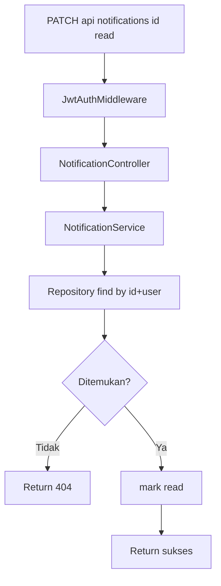
```mermaid
flowchart TD
	A[PATCH api notifications id read] --> B[JwtAuthMiddleware]
	B --> C[NotificationController]
	C --> D[NotificationService]
	D --> E[Repository find by id+user]
	E --> F{Ditemukan?}
	F -- Tidak --> G[Return 404]
	F -- Ya --> H[mark read]
	H --> I[Return sukses]
```

### 5.5 Class Diagram

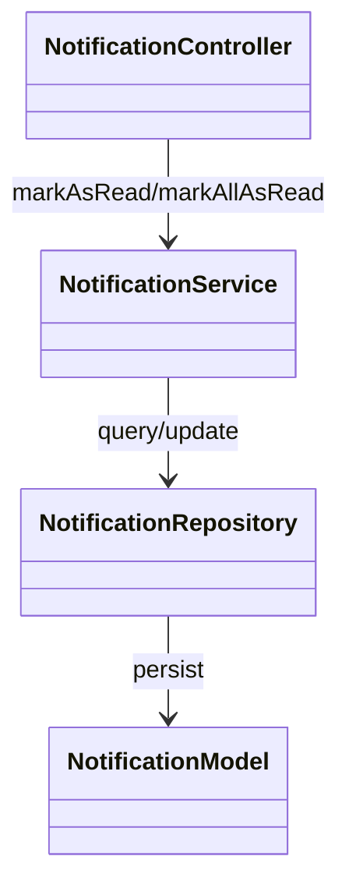
```mermaid
classDiagram
    class NotificationController
    class NotificationService
    class NotificationRepository
    class NotificationModel

    NotificationController --> NotificationService : markAsRead/markAllAsRead
    NotificationService --> NotificationRepository : query/update
    NotificationRepository --> NotificationModel : persist
```

---

## Bab 6 - Fitur Sinkronisasi Aksi Notifikasi (Scheduler)

### 6.1 Penjelasan Fitur

Sinkronisasi aksi notifikasi memastikan `list_aksi` pada dashboard pegawai selalu mengikuti kondisi terbaru data pegawai.

Rule utama yang disinkronkan:

1. STR tidak ada / expired / akan expired (<= 90 hari).
2. Data keluarga belum lengkap.

Sinkronisasi dijalankan:

1. Saat dashboard pegawai dibuka (on-request sync).
2. Harian via scheduler command (batch).

### 6.2 File Yang Dipakai

1. `routes/console.php`
2. `app/Console/Commands/SyncDashboardNotificationActions.php`
3. `app/Services/Notification/NotificationActionSyncService.php`
4. `app/Repositories/Notification/NotificationRepository.php`
5. `database/migrations/2026_04_18_000100_add_action_fields_to_notification_table.php`
6. `database/migrations/2026_04_18_000200_make_notification_user_unique_key_unique.php`

### 6.3 Kode Yang Dipakai

```php
Schedule::command('notifications:sync-dashboard-actions --batch=50')
	->dailyAt('01:00')
	->withoutOverlapping();
```

```php
$this->notificationRepository->upsertActionNotification(
	userId: $userId,
	uniqueKey: $uniqueKey,
	title: $title,
	message: $message,
	actionCode: $actionCode,
	actionPayload: $payload
);

$this->notificationRepository->resolveMissingActionNotifications($userId, $activeUniqueKeys);
```

### 6.4 Flowchart

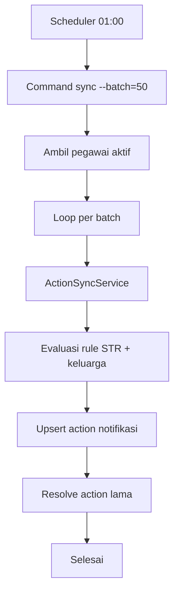
```mermaid
flowchart TD
	A[Scheduler 01:00] --> B[Command sync --batch=50]
	B --> C[Ambil pegawai aktif]
	C --> D[Loop per batch]
	D --> E[ActionSyncService]
	E --> F[Evaluasi rule STR + keluarga]
	F --> G[Upsert action notifikasi]
	G --> H[Resolve action lama]
	H --> I[Selesai]
```

### 6.5 Class Diagram

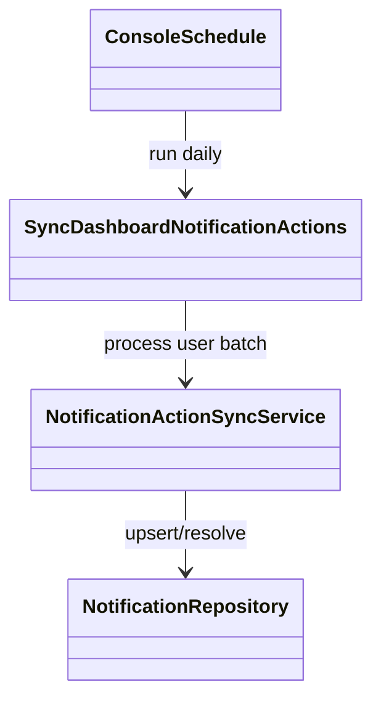
```mermaid
classDiagram
    class ConsoleSchedule
    class SyncDashboardNotificationActions
    class NotificationActionSyncService
    class NotificationRepository

    ConsoleSchedule --> SyncDashboardNotificationActions : run daily
    SyncDashboardNotificationActions --> NotificationActionSyncService : process user batch
    NotificationActionSyncService --> NotificationRepository : upsert/resolve
```

---

## Bab 7 - Catatan Testing

### 7.1 Testing Otomatis

1. `php artisan test` lulus.
2. `php artisan test tests/Feature/Api/NotificationActionLifecycleTest.php` lulus.

### 7.2 Testing Manual

1. `php artisan migrate:fresh --seed` sukses.
2. Smoke test dashboard pegawai menunjukkan aksi aktif berubah sesuai perubahan data.

### 7.3 Catatan Data Uji

1. Seeder menghasilkan user lintas role.
2. Seeder utama aktif berisi 4 akun role utama (admin, hrd, direktur, pegawai).
3. Seeder `BudiProfileChangeRequestSeeder` membuat 1 pengajuan profile `pending` milik Budi untuk simulasi approval admin.

---

## Bab 8 - Fitur Profile API

### 8.1 Penjelasan Fitur

Endpoint `GET /api/profile` dipakai untuk menampilkan data profil berdasarkan role login.

Untuk role `pegawai`, data profile saat ini sudah membaca data real dari tabel relasi pegawai, bukan dummy.

Field profile pegawai yang dikembalikan:

1. `nip`
2. `nik`
3. `nama`
4. `jenis_pegawai`
5. `profesi` (prioritas relasi `profesi_pegawai` dengan `is_current=true`)
6. `pendidikan_terakhir`
7. `unit_kerja` (prioritas relasi `unit_kerja_pegawai` dengan `is_current=true`)
8. `jk`
9. `tanggal_lahir`
10. `jabatan_sekarang` (prioritas relasi `jabatan_pegawai` dengan `is_current=true`)
11. `agama`
12. `status_kawin`
13. `alamat`
14. `no_telp`
15. `email`
16. `link_photo_profile`
17. `status_pegawai`
18. `tgl_masuk`
19. `pangkat` (prioritas relasi `pangkat_pegawai` dengan `is_current=true`)
20. `golongan_ruang` (prioritas relasi `golongan_ruang_pegawai` dengan `is_current=true`)
21. `tmt_cpns`
22. `tmt_pns`
23. `tmt_pangkat`
24. `masa_kerja` (hasil kalkulasi dari `tgl_masuk`)
25. `status_perubahan`
	1. `fitur` (fitur change request terbaru, contoh `profile`)
	2. `status` (status change request terbaru: `pending`/`approved`/`rejected`)
	3. `note` (catatan change request terbaru)
	4. `last_update` (waktu update terakhir data profile utama dan relasi current)

### 8.2 File Yang Dipakai

1. `routes/api.php`
2. `app/Http/Controllers/Api/ProfileController.php`
3. `app/Services/Profile/ProfileService.php`
4. `app/Services/Profile/PegawaiService.php`
5. `app/Services/Profile/AdminService.php`
6. `app/Services/Profile/HrdService.php`
7. `app/Services/Profile/DirekturService.php`
8. `app/Models/User.php`
9. `app/Models/Pegawai.php`
10. `app/Models/PegawaiPribadi.php`

### 8.3 Kode Yang Dipakai

```php
Route::middleware([
	JwtAuthMiddleware::class,
	RoleMiddleware::class.':admin,pegawai,hrd,direktur',
])->get('/profile', [ProfileController::class, 'show']);
```

```php
$payload = $this->profileService->getPayloadByRole($role, $userId);

return response()->json([
	'success' => true,
	'message' => $payload['welcome'],
	'data' => [
		'role' => $role,
		'profile' => $payload['summary'],
	],
]);
```

### 8.4 Flowchart

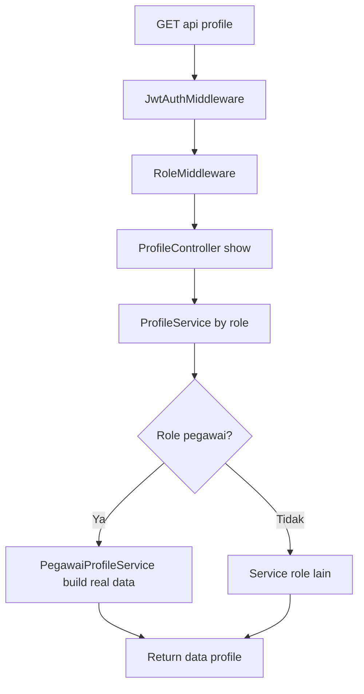
```mermaid
flowchart TD
	A[GET api profile] --> B[JwtAuthMiddleware]
	B --> C[RoleMiddleware]
	C --> D[ProfileController show]
	D --> E[ProfileService by role]
	E --> F{Role pegawai?}
	F -- Ya --> G[PegawaiProfileService build real data]
	F -- Tidak --> H[Service role lain]
	G --> I[Return data profile]
	H --> I
```

### 8.5 Class Diagram

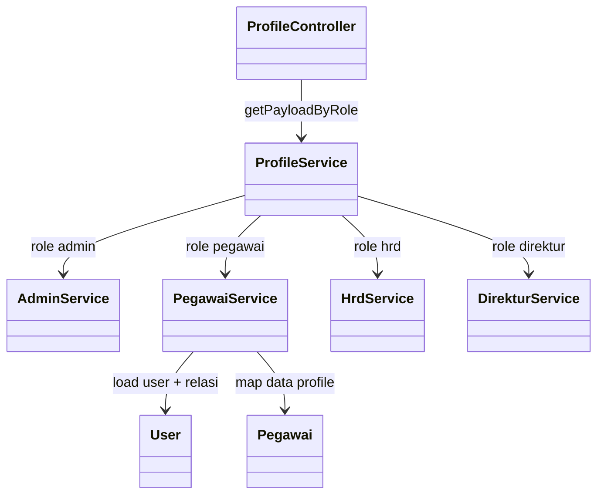
```mermaid
classDiagram
	class ProfileController
	class ProfileService
	class AdminService
	class PegawaiService
	class HrdService
	class DirekturService
	class User
	class Pegawai

	ProfileController --> ProfileService : getPayloadByRole
	ProfileService --> AdminService : role admin
	ProfileService --> PegawaiService : role pegawai
	ProfileService --> HrdService : role hrd
	ProfileService --> DirekturService : role direktur
	PegawaiService --> User : load user + relasi
	PegawaiService --> Pegawai : map data profile
```

---

## Catatan Penamaan Endpoint

1. Dokumentasi bisnis sering menyebut `/api/notifikasi`.
2. Route implementasi saat ini adalah `/api/notifications`.
3. Jika diperlukan, dapat ditambahkan alias route `/api/notifikasi` tanpa mengubah route existing.

---

## Bab 9 - Fitur Approval Change Request Profile (Admin)

### 9.1 Penjelasan Fitur

Fitur ini dipakai untuk proses review pengajuan perubahan profile yang diajukan pegawai melalui endpoint `PATCH /api/profile`.

Alur utama:

1. Pegawai submit perubahan profile, sistem menyimpan ke `perubahan_data` (header) dan `detail_perubahan_data` (detail) dengan status `pending`.
2. Admin melihat daftar pengajuan dan detail pengajuan.
3. Admin memilih aksi:
	1. `accept`: status menjadi `approved` dan perubahan profile diaplikasikan ke tabel master (`pegawai` dan `pegawai_pribadi`).
	2. `reject`: status menjadi `rejected` tanpa mengubah tabel master.

### 9.2 File Yang Dipakai

1. `routes/api.php`
2. `app/Http/Controllers/Api/ChangeRequestAdminController.php`
3. `app/Services/ChangeRequest/ChangeRequestAdminService.php`
4. `app/Repositories/ChangeRequest/ChangeRequestRepository.php`
5. `app/Models/PerubahanData.php`
6. `app/Models/DetailPerubahanData.php`
7. `app/Models/Pegawai.php`
8. `app/Models/PegawaiPribadi.php`
9. `database/migrations/2026_04_19_000200_refactor_perubahan_data_table.php`
10. `database/migrations/2026_04_19_000300_create_detail_perubahan_data_table.php`
11. `database/seeders/BudiProfileChangeRequestSeeder.php`

### 9.3 Kode Yang Dipakai

```php
Route::middleware([
	JwtAuthMiddleware::class,
	RoleMiddleware::class.':admin',
])->prefix('admin')->group(function () {
	Route::get('/change-requests', [ChangeRequestAdminController::class, 'index']);
	Route::get('/change-requests/{id}', [ChangeRequestAdminController::class, 'show']);
	Route::patch('/change-requests/{id}/accept', [ChangeRequestAdminController::class, 'accept']);
	Route::patch('/change-requests/{id}/reject', [ChangeRequestAdminController::class, 'reject']);
});
```

```php
if ((string) $item->fitur === 'profile') {
	$this->applyProfileDetails($item);
}

$item->status = 'approved';
$item->note = $this->mergeAdminNote($item->note, 'APPROVED', $adminNote);
```

```php
$item->status = 'rejected';
$item->note = $this->mergeAdminNote($item->note, 'REJECTED', $adminNote);
```

### 9.4 Flowchart

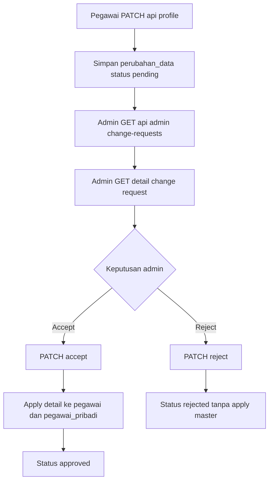
```mermaid
flowchart TD
	A[Pegawai PATCH api profile] --> B[Simpan perubahan_data status pending]
	B --> C[Admin GET api admin change-requests]
	C --> D[Admin GET detail change request]
	D --> E{Keputusan admin}
	E -- Accept --> F[PATCH accept]
	F --> G[Apply detail ke pegawai dan pegawai_pribadi]
	G --> H[Status approved]
	E -- Reject --> I[PATCH reject]
	I --> J[Status rejected tanpa apply master]
```

### 9.5 Class Diagram

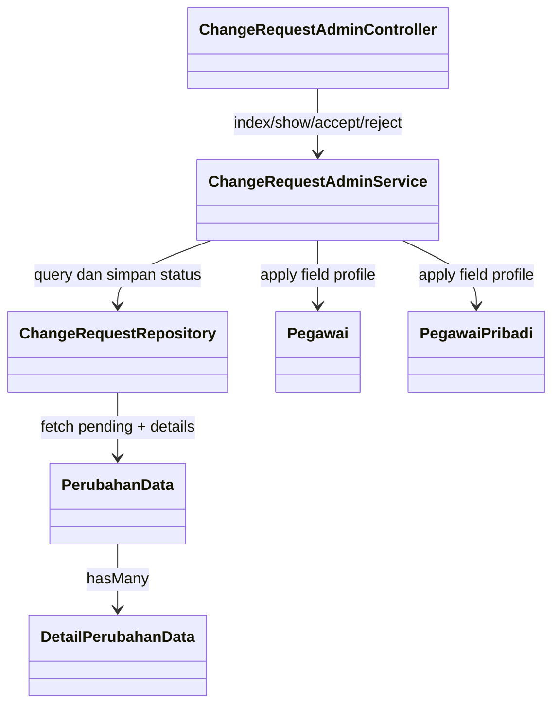
```mermaid
classDiagram
	class ChangeRequestAdminController
	class ChangeRequestAdminService
	class ChangeRequestRepository
	class PerubahanData
	class DetailPerubahanData
	class Pegawai
	class PegawaiPribadi

	ChangeRequestAdminController --> ChangeRequestAdminService : index/show/accept/reject
	ChangeRequestAdminService --> ChangeRequestRepository : query dan simpan status
	ChangeRequestRepository --> PerubahanData : fetch pending + details
	PerubahanData --> DetailPerubahanData : hasMany
	ChangeRequestAdminService --> Pegawai : apply field profile
	ChangeRequestAdminService --> PegawaiPribadi : apply field profile
```

---

## Bab 10 - Fitur Diklat API

### 10.1 Penjelasan Fitur

Endpoint `GET /api/diklat` menampilkan data diklat berdasarkan role login.

Pada implementasi saat ini, struktur payload antar role sudah dibedakan dan untuk role `pegawai` data sudah diambil dari database melalui repository.

1. `admin`: ringkasan total program dan list diklat institusi.
2. `pegawai`: ringkasan riwayat pribadi dan list riwayat diklat pegawai dari tabel `list_jadwal_diklat` + relasi `diklat`.
3. `hrd`: ringkasan usulan dan list usulan diklat per unit.
4. `direktur`: ringkasan anggaran dan list keputusan terbaru.

Field detail item diklat yang digunakan:

1. `nama`
2. `kategori`
3. `jenis`
4. `pelaksana`
5. `tanggal_mulai`
6. `tanggal_selesai`
7. `tempat`
8. `waktu`
9. `created_by`
10. `jp`
11. `total_biaya`
12. `jenis_biaya`
13. `jenis_pelaksana`

### 10.2 File Yang Dipakai

1. `routes/api.php`
2. `app/Http/Controllers/Api/DiklatController.php`
3. `app/Services/Diklat/DiklatService.php`
4. `app/Services/Diklat/AdminService.php`
5. `app/Services/Diklat/PegawaiService.php`
6. `app/Services/Diklat/HrdService.php`
7. `app/Services/Diklat/DirekturService.php`
8. `app/Repositories/Diklat/PegawaiDiklatRepository.php`
9. `app/Models/Diklat.php`
10. `app/Models/ListJadwalDiklat.php`
11. `app/Models/JenisDiklat.php`
12. `app/Models/KategoriDiklat.php`
13. `app/Models/JenisBiaya.php`

### 10.3 Kode Yang Dipakai

```php
Route::middleware([
	JwtAuthMiddleware::class,
	RoleMiddleware::class.':admin,pegawai,hrd,direktur',
])->get('/diklat', [DiklatController::class, 'index']);
```

```php
$payload = $this->diklatService->getPayloadByRole($role, $userId);

return response()->json([
	'success' => true,
	'message' => $payload['welcome'],
	'data' => [
		'role' => $role,
		'diklat' => $payload['summary'],
	],
]);
```

### 10.4 Flowchart

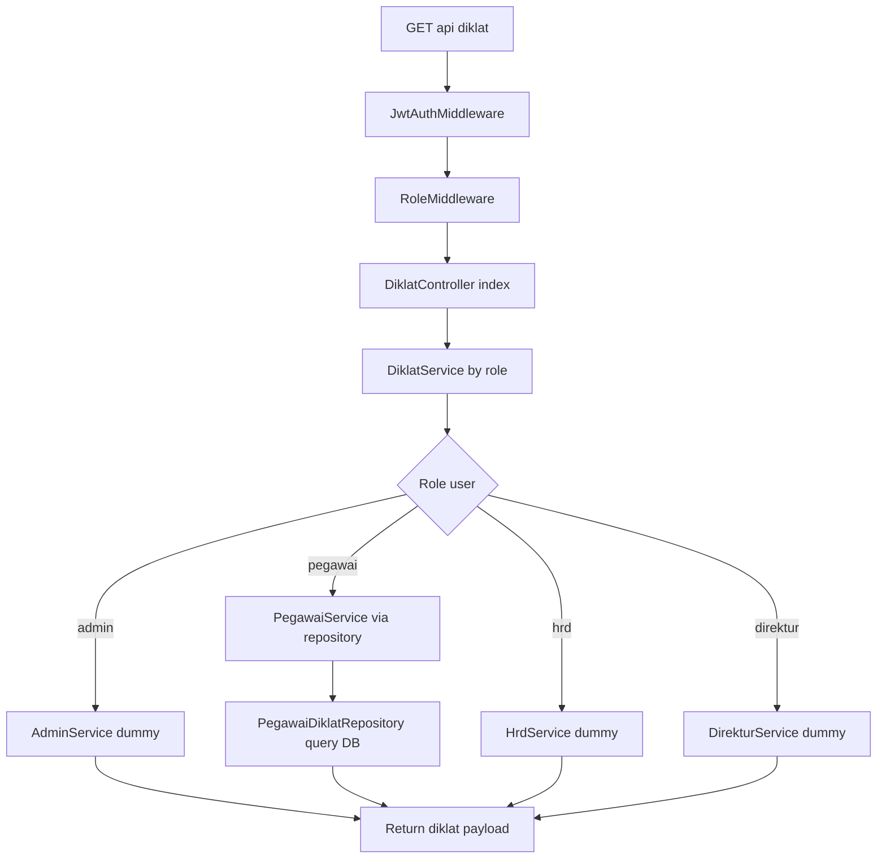
```mermaid
flowchart TD
	A[GET api diklat] --> B[JwtAuthMiddleware]
	B --> C[RoleMiddleware]
	C --> D[DiklatController index]
	D --> E[DiklatService by role]
	E --> F{Role user}
	F -- admin --> G[AdminService dummy]
	F -- pegawai --> H[PegawaiService via repository]
	F -- hrd --> I[HrdService dummy]
	F -- direktur --> J[DirekturService dummy]
	H --> H1[PegawaiDiklatRepository query DB]
	G --> K[Return diklat payload]
	H1 --> K
	I --> K
	J --> K
```

### 10.5 Class Diagram

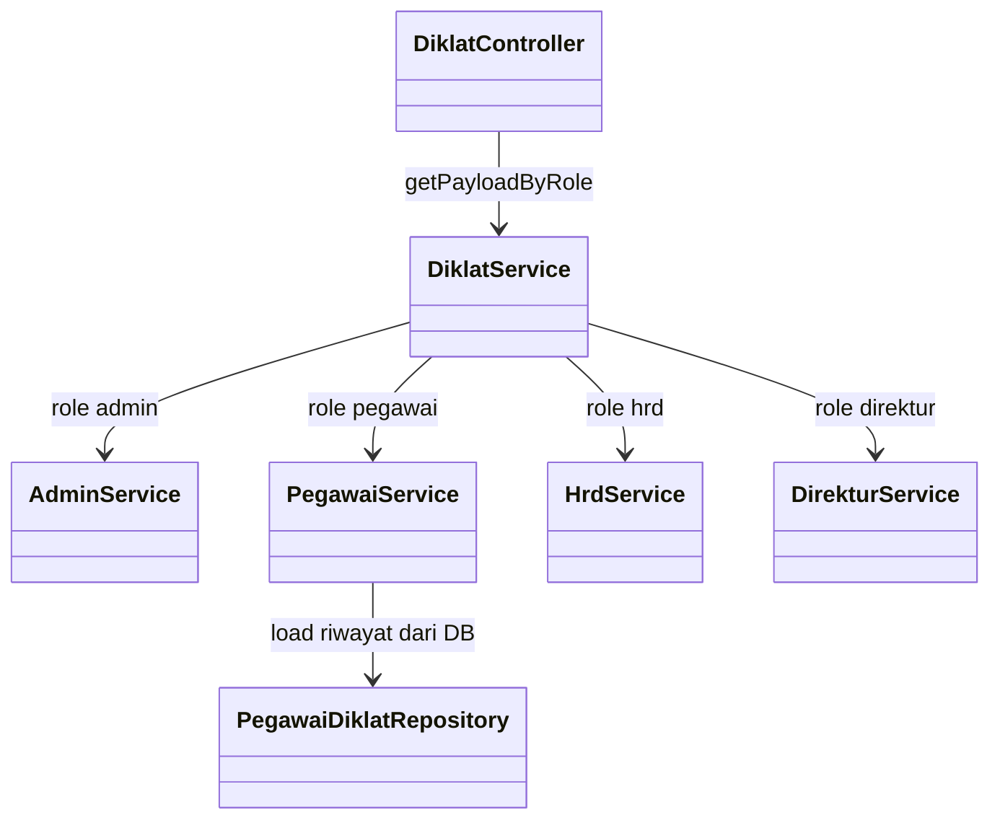
```mermaid
classDiagram
	class DiklatController
	class DiklatService
	class AdminService
	class PegawaiService
	class PegawaiDiklatRepository
	class HrdService
	class DirekturService

	DiklatController --> DiklatService : getPayloadByRole
	DiklatService --> AdminService : role admin
	DiklatService --> PegawaiService : role pegawai
	PegawaiService --> PegawaiDiklatRepository : load riwayat dari DB
	DiklatService --> HrdService : role hrd
	DiklatService --> DirekturService : role direktur
```

---

## Bab 11 - Fitur Upload Foto Profile (Tanpa Approval)

### 11.1 Penjelasan Fitur

Endpoint upload foto profile dipakai untuk update foto user login secara langsung tanpa melalui alur persetujuan admin.

Endpoint yang tersedia:

1. `POST /api/profil/profil-picture`
2. `POST /api/profile/profile-picture` (alias)

Karakteristik fitur:

1. Wajib upload file form-data dengan key `foto`.
2. Validasi file: `image`, ekstensi `jpg/jpeg/png/webp`, maksimal 2MB.
3. File disimpan ke folder publik `public/dokumen/foto`.
4. Kolom `pegawai_pribadi.foto_path` diperbarui langsung.
5. Foto lama lokal dihapus jika ada.
6. Tidak membuat record `perubahan_data`.

### 11.2 File Yang Dipakai

1. `routes/api.php`
2. `app/Http/Controllers/Api/ProfileController.php`
3. `app/Http/Requests/Profile/UploadProfilePictureRequest.php`
4. `app/Services/Profile/ProfileService.php`
5. `app/Models/PegawaiPribadi.php`

### 11.3 Kode Yang Dipakai

```php
Route::middleware([
	JwtAuthMiddleware::class,
	RoleMiddleware::class.':admin,pegawai,hrd,direktur',
])->post('/profil/profil-picture', [ProfileController::class, 'updateProfilePicture']);
```

```php
public function rules(): array
{
	return [
		'foto' => ['required', 'file', 'image', 'mimes:jpg,jpeg,png,webp', 'max:2048'],
	];
}
```

```php
$folder = public_path('dokumen/foto');
$file->move($folder, $filename);
$pribadi->foto_path = 'dokumen/foto/'.$filename;
$pribadi->save();
```

### 11.4 Flowchart

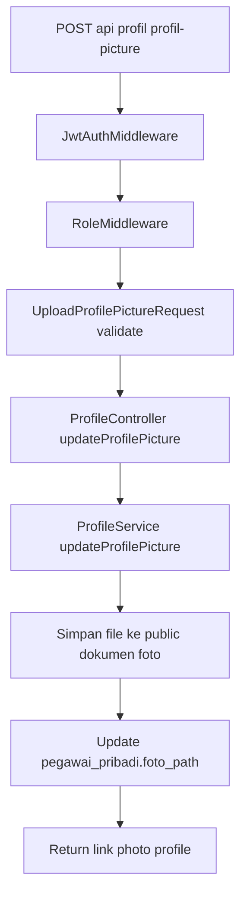
```mermaid
flowchart TD
	A[POST api profil profil-picture] --> B[JwtAuthMiddleware]
	B --> C[RoleMiddleware]
	C --> D[UploadProfilePictureRequest validate]
	D --> E[ProfileController updateProfilePicture]
	E --> F[ProfileService updateProfilePicture]
	F --> G[Simpan file ke public dokumen foto]
	G --> H[Update pegawai_pribadi.foto_path]
	H --> I[Return link photo profile]
```

### 11.5 Class Diagram

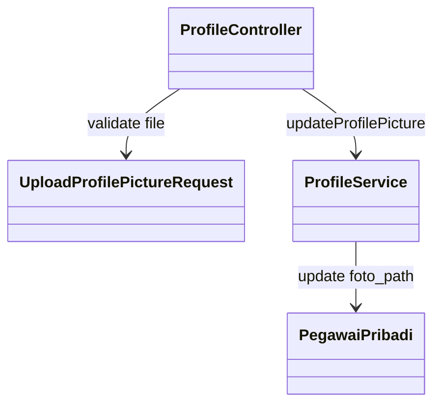
```mermaid
classDiagram
	class ProfileController
	class UploadProfilePictureRequest
	class ProfileService
	class PegawaiPribadi

	ProfileController --> UploadProfilePictureRequest : validate file
	ProfileController --> ProfileService : updateProfilePicture
	ProfileService --> PegawaiPribadi : update foto_path
```
