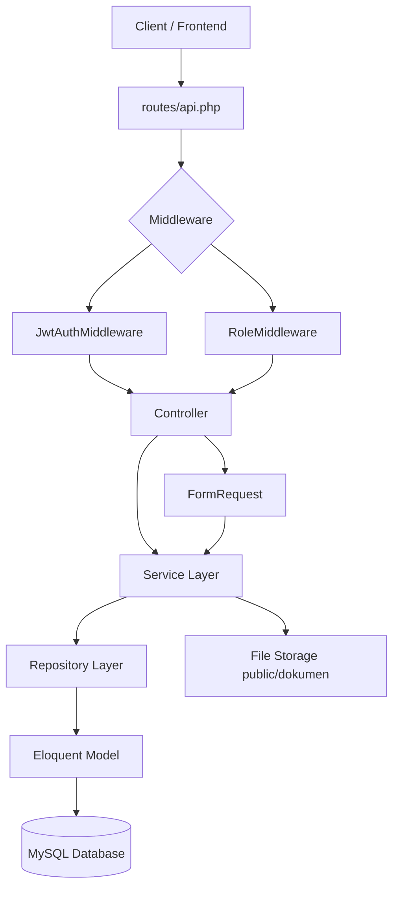
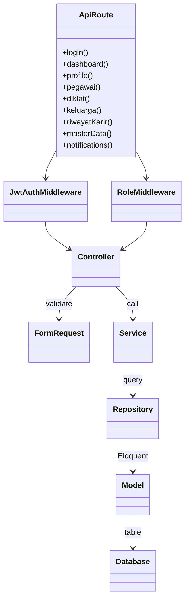
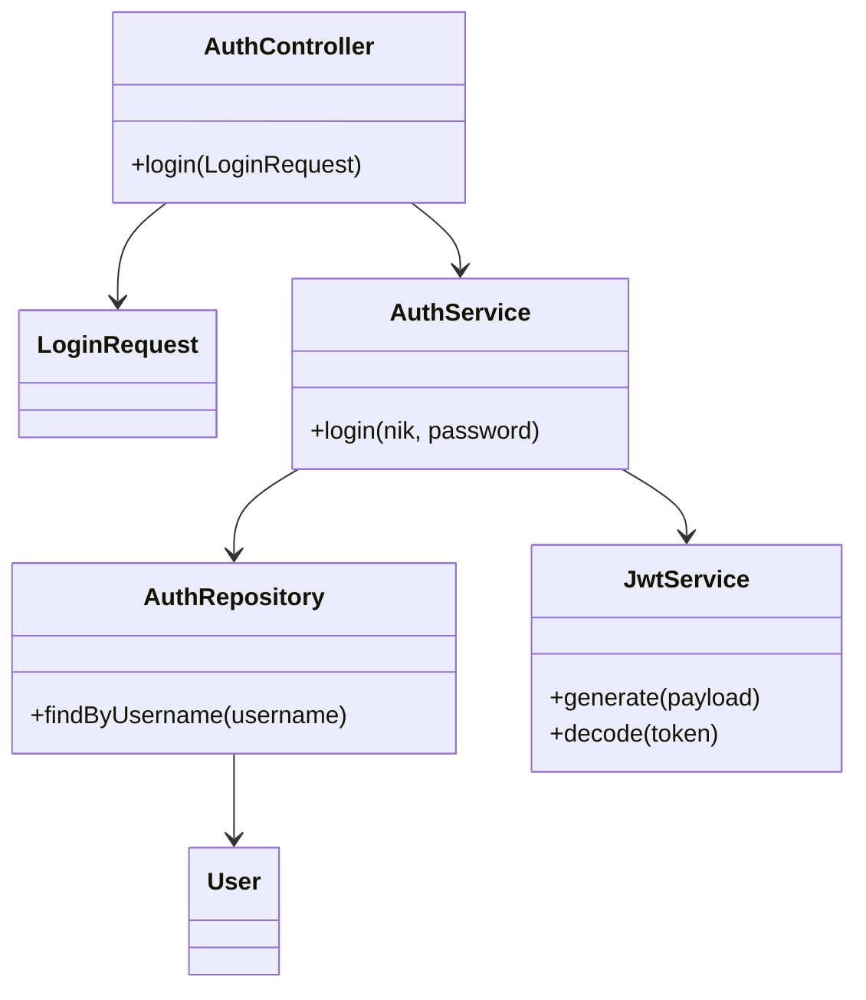
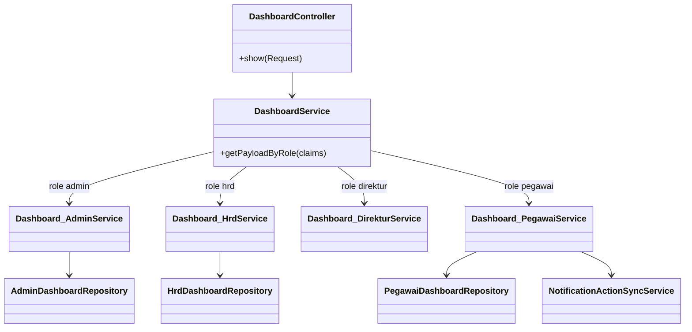
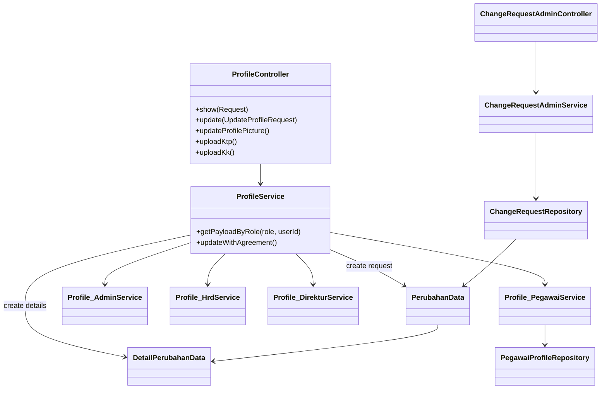
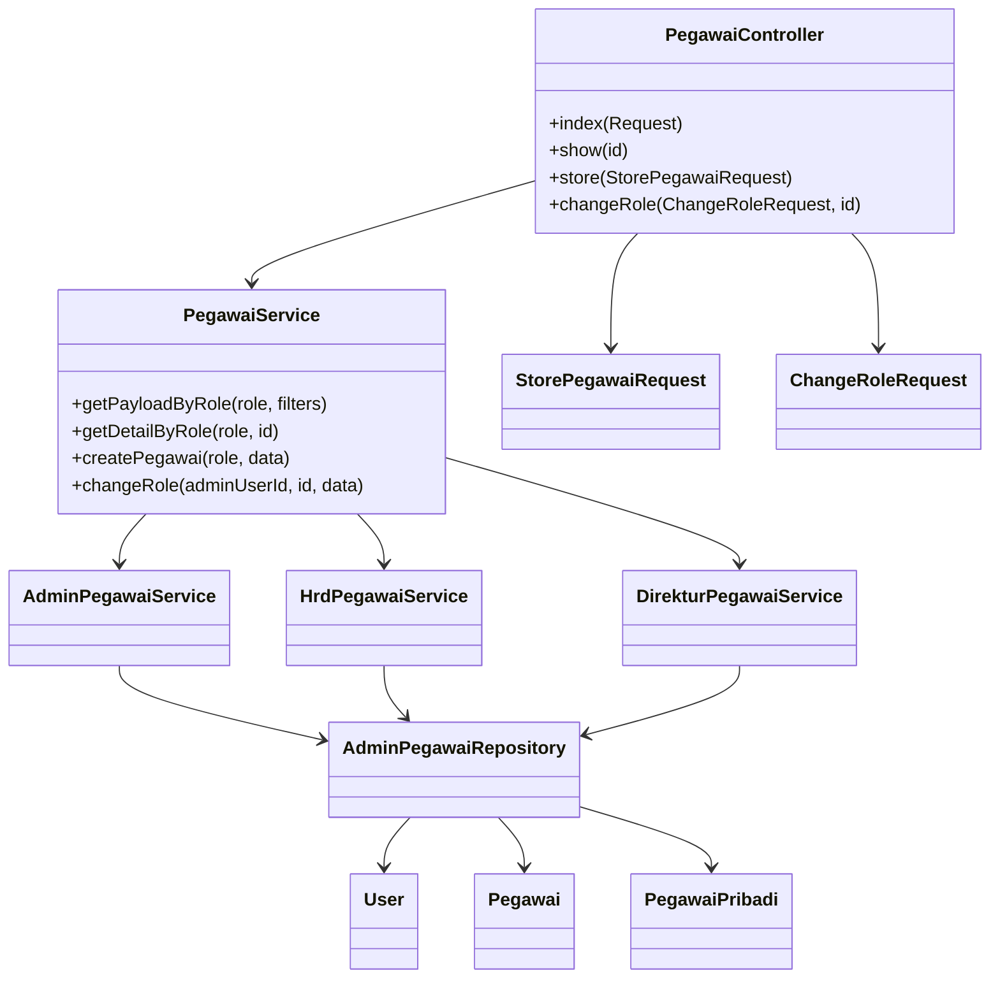
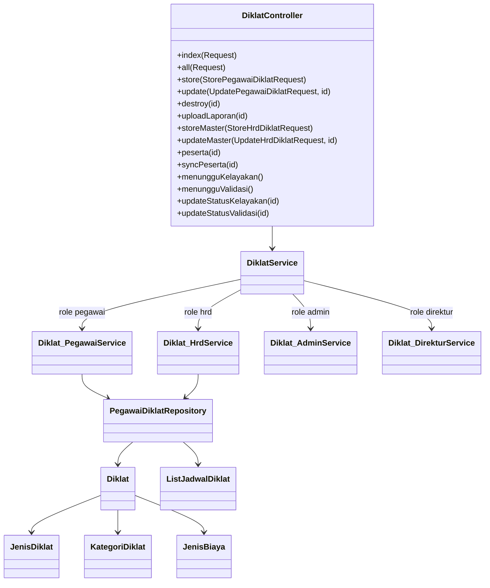
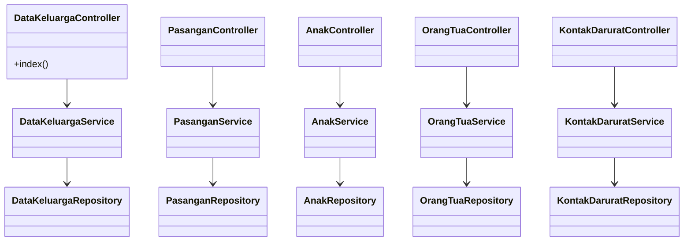
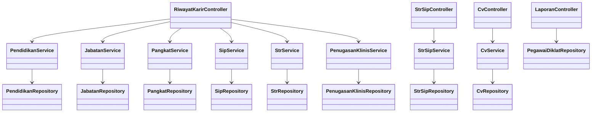
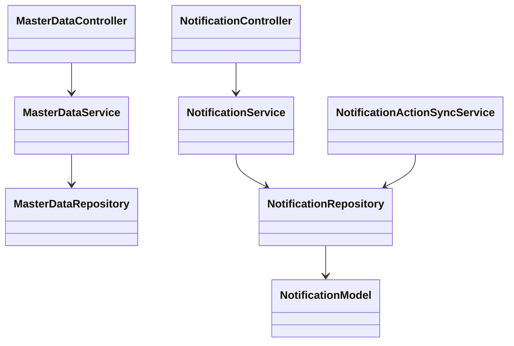

# Dokumentasi Aplikasi BE SIMPEG RSKALISAT

Dokumentasi ini menjelaskan struktur aplikasi backend Laravel SIMPEG RSKALISAT berdasarkan kondisi kode saat ini. Fokus dokumen ini adalah arsitektur aplikasi, class diagram, ERD, endpoint utama, dan tree file backend.

Terakhir diperbarui: 2026-06-06

## Daftar Isi

1. [Ringkasan Aplikasi](#ringkasan-aplikasi)
2. [Arsitektur Backend](#arsitektur-backend)
3. [Role dan Hak Akses](#role-dan-hak-akses)
4. [Class Diagram](#class-diagram)
5. [ERD](#erd)
6. [Endpoint Utama](#endpoint-utama)
7. [Tree File Project](#tree-file-project)
8. [Catatan Seeder dan Testing](#catatan-seeder-dan-testing)

---

## Ringkasan Aplikasi

BE SIMPEG RSKALISAT adalah backend REST API untuk sistem informasi kepegawaian. Aplikasi ini menangani autentikasi, dashboard berbasis role, data pegawai, profile, keluarga, riwayat karir, STR/SIP, diklat, laporan diklat, notifikasi, master data, dan approval perubahan data profile.

Stack utama:

1. Laravel sebagai framework backend.
2. MySQL sebagai database utama.
3. JWT custom untuk autentikasi API.
4. Form Request untuk validasi input.
5. Service layer untuk business logic.
6. Repository layer untuk query database yang lebih kompleks.
7. Eloquent Model untuk representasi tabel dan relasi.

Role aktif:

1. `admin`
2. `hrd`
3. `direktur`
4. `pegawai`

---

## Arsitektur Backend

Pola umum request:

```text
Client
  -> routes/api.php
  -> JwtAuthMiddleware
  -> RoleMiddleware
  -> Controller
  -> FormRequest
  -> Service
  -> Repository
  -> Eloquent Model
  -> Database
```

Pembagian tanggung jawab:

1. `routes/api.php`: mendefinisikan endpoint dan middleware.
2. `app/Http/Controllers/Api`: menerima HTTP request dan mengembalikan JSON response.
3. `app/Http/Requests`: validasi request.
4. `app/Services`: business logic, mapping response, rule role, upload file, dan transaksi.
5. `app/Repositories`: query database, eager load relasi, agregasi, dan persist data.
6. `app/Models`: model Eloquent dan relasi antar tabel.
7. `database/migrations`: struktur tabel.
8. `database/seeders`: data awal dan data uji.

Diagram arsitektur:


```mermaid
flowchart TD
    A[Client / Frontend] --> B[routes/api.php]
    B --> C{Middleware}
    C --> D[JwtAuthMiddleware]
    C --> E[RoleMiddleware]
    D --> F[Controller]
    E --> F
    F --> G[FormRequest]
    F --> H[Service Layer]
    G --> H
    H --> I[Repository Layer]
    H --> J[File Storage public/dokumen]
    I --> K[Eloquent Model]
    K --> L[(MySQL Database)]
```

---

## Role dan Hak Akses

| Role | Akses Utama |
| --- | --- |
| `admin` | Login, role, dashboard, profile, data pegawai, tambah pegawai, change role/status pegawai, approval perubahan profile, master data read, notifikasi, generate CV |
| `hrd` | Login, role, dashboard, profile, daftar pegawai, STR/SIP, diklat all, master diklat, approval kelayakan/validasi diklat, master data CRUD, laporan diklat, notifikasi, generate CV |
| `direktur` | Login, role, dashboard, profile, daftar pegawai, STR/SIP, diklat all, master data read, notifikasi, generate CV |
| `pegawai` | Login, role, dashboard, profile, update profile dengan approval, upload foto/KTP/KK, data keluarga, riwayat karir, diklat pribadi, upload laporan diklat, notifikasi, generate CV |

---

## Class Diagram

### Class Diagram Global


```mermaid
classDiagram
    class ApiRoute {
        +login()
        +dashboard()
        +profile()
        +pegawai()
        +diklat()
        +keluarga()
        +riwayatKarir()
        +masterData()
        +notifications()
    }

    class JwtAuthMiddleware
    class RoleMiddleware
    class Controller
    class FormRequest
    class Service
    class Repository
    class Model
    class Database

    ApiRoute --> JwtAuthMiddleware
    ApiRoute --> RoleMiddleware
    JwtAuthMiddleware --> Controller
    RoleMiddleware --> Controller
    Controller --> FormRequest : validate
    Controller --> Service : call
    Service --> Repository : query
    Repository --> Model : Eloquent
    Model --> Database : table
```

### Auth dan Security


```mermaid
classDiagram
    class AuthController {
        +login(LoginRequest)
    }
    class LoginRequest
    class AuthService {
        +login(nik, password)
    }
    class AuthRepository {
        +findByUsername(username)
    }
    class JwtService {
        +generate(payload)
        +decode(token)
    }
    class User

    AuthController --> LoginRequest
    AuthController --> AuthService
    AuthService --> AuthRepository
    AuthService --> JwtService
    AuthRepository --> User
```

### Dashboard


```mermaid
classDiagram
    class DashboardController {
        +show(Request)
    }
    class DashboardService {
        +getPayloadByRole(claims)
    }
    class Dashboard_AdminService
    class Dashboard_HrdService
    class Dashboard_DirekturService
    class Dashboard_PegawaiService
    class AdminDashboardRepository
    class HrdDashboardRepository
    class PegawaiDashboardRepository
    class NotificationActionSyncService

    DashboardController --> DashboardService
    DashboardService --> Dashboard_AdminService : role admin
    DashboardService --> Dashboard_HrdService : role hrd
    DashboardService --> Dashboard_DirekturService : role direktur
    DashboardService --> Dashboard_PegawaiService : role pegawai
    Dashboard_AdminService --> AdminDashboardRepository
    Dashboard_HrdService --> HrdDashboardRepository
    Dashboard_PegawaiService --> PegawaiDashboardRepository
    Dashboard_PegawaiService --> NotificationActionSyncService
```

### Profile dan Approval Perubahan Data


```mermaid
classDiagram
    class ProfileController {
        +show(Request)
        +update(UpdateProfileRequest)
        +updateProfilePicture()
        +uploadKtp()
        +uploadKk()
    }
    class ProfileService {
        +getPayloadByRole(role, userId)
        +updateWithAgreement()
    }
    class Profile_PegawaiService
    class Profile_AdminService
    class Profile_HrdService
    class Profile_DirekturService
    class PegawaiProfileRepository
    class ChangeRequestAdminController
    class ChangeRequestAdminService
    class ChangeRequestRepository
    class PerubahanData
    class DetailPerubahanData

    ProfileController --> ProfileService
    ProfileService --> Profile_PegawaiService
    ProfileService --> Profile_AdminService
    ProfileService --> Profile_HrdService
    ProfileService --> Profile_DirekturService
    Profile_PegawaiService --> PegawaiProfileRepository
    ProfileService --> PerubahanData : create request
    ProfileService --> DetailPerubahanData : create details
    ChangeRequestAdminController --> ChangeRequestAdminService
    ChangeRequestAdminService --> ChangeRequestRepository
    ChangeRequestRepository --> PerubahanData
    PerubahanData --> DetailPerubahanData
```

Catatan profile terbaru:

1. Role `admin`, `hrd`, `direktur`, dan `pegawai` memakai data real dari relasi `users -> pegawai -> pegawai_pribadi`.
2. Jika data profile belum ada, response mengembalikan `null`, bukan dummy.
3. Field `no_kk` dan `link_kk` sudah didukung pada model `PegawaiPribadi`.

### Pegawai


```mermaid
classDiagram
    class PegawaiController {
        +index(Request)
        +show(id)
        +store(StorePegawaiRequest)
        +changeRole(ChangeRoleRequest, id)
    }
    class PegawaiService {
        +getPayloadByRole(role, filters)
        +getDetailByRole(role, id)
        +createPegawai(role, data)
        +changeRole(adminUserId, id, data)
    }
    class AdminPegawaiService
    class HrdPegawaiService
    class DirekturPegawaiService
    class AdminPegawaiRepository
    class StorePegawaiRequest
    class ChangeRoleRequest
    class Pegawai
    class User
    class PegawaiPribadi

    PegawaiController --> StorePegawaiRequest
    PegawaiController --> ChangeRoleRequest
    PegawaiController --> PegawaiService
    PegawaiService --> AdminPegawaiService
    PegawaiService --> HrdPegawaiService
    PegawaiService --> DirekturPegawaiService
    AdminPegawaiService --> AdminPegawaiRepository
    HrdPegawaiService --> AdminPegawaiRepository
    DirekturPegawaiService --> AdminPegawaiRepository
    AdminPegawaiRepository --> User
    AdminPegawaiRepository --> Pegawai
    AdminPegawaiRepository --> PegawaiPribadi
```

Catatan pegawai terbaru:

1. `GET /api/pegawai` mendukung `page`, `per_page`, `search`, `status_kelengkapan`, `jenis_pegawai`, `pendidikan`, `status_pegawai`, dan `profesi`.
2. Item pegawai menyertakan informasi role.
3. Root response menyertakan `jumlah_admin`, `jumlah_hrd`, dan `jumlah_direktur`.
4. `PATCH /api/pegawai/{id}/change-role` hanya untuk admin dan dapat mengubah `role` serta `status_pegawai`.

### Diklat


```mermaid
classDiagram
    class DiklatController {
        +index(Request)
        +all(Request)
        +store(StorePegawaiDiklatRequest)
        +update(UpdatePegawaiDiklatRequest, id)
        +destroy(id)
        +uploadLaporan(id)
        +storeMaster(StoreHrdDiklatRequest)
        +updateMaster(UpdateHrdDiklatRequest, id)
        +peserta(id)
        +syncPeserta(id)
        +menungguKelayakan()
        +menungguValidasi()
        +updateStatusKelayakan(id)
        +updateStatusValidasi(id)
    }
    class DiklatService
    class Diklat_PegawaiService
    class Diklat_HrdService
    class Diklat_AdminService
    class Diklat_DirekturService
    class PegawaiDiklatRepository
    class Diklat
    class ListJadwalDiklat
    class JenisDiklat
    class KategoriDiklat
    class JenisBiaya

    DiklatController --> DiklatService
    DiklatService --> Diklat_PegawaiService : role pegawai
    DiklatService --> Diklat_HrdService : role hrd
    DiklatService --> Diklat_AdminService : role admin
    DiklatService --> Diklat_DirekturService : role direktur
    Diklat_PegawaiService --> PegawaiDiklatRepository
    Diklat_HrdService --> PegawaiDiklatRepository
    PegawaiDiklatRepository --> Diklat
    PegawaiDiklatRepository --> ListJadwalDiklat
    Diklat --> JenisDiklat
    Diklat --> KategoriDiklat
    Diklat --> JenisBiaya
```

Catatan diklat terbaru:

1. `GET /api/diklat` mendukung pagination, search, filter `jenis`, dan filter status `mendatang`, `berlangsung`, `selesai`.
2. `GET /api/diklat/all` mendukung pagination, search, dan filter `jenis`.
3. Response list diklat memiliki `uploadlaporan` boolean.
4. Diklat external tidak bisa di-ACC kelayakan jika `sertif_file_path` atau `no_sertif` belum ada.
5. Diklat internal tidak bisa di-ACC validasi jika `sertif_file_path` atau `no_sertif` belum ada.
6. Jika rule dilanggar, API mengembalikan pesan `belum upload laporan`.

### Keluarga


```mermaid
classDiagram
    class DataKeluargaController {
        +index()
    }
    class PasanganController
    class AnakController
    class OrangTuaController
    class KontakDaruratController
    class DataKeluargaService
    class PasanganService
    class AnakService
    class OrangTuaService
    class KontakDaruratService
    class DataKeluargaRepository
    class PasanganRepository
    class AnakRepository
    class OrangTuaRepository
    class KontakDaruratRepository

    DataKeluargaController --> DataKeluargaService
    PasanganController --> PasanganService
    AnakController --> AnakService
    OrangTuaController --> OrangTuaService
    KontakDaruratController --> KontakDaruratService
    DataKeluargaService --> DataKeluargaRepository
    PasanganService --> PasanganRepository
    AnakService --> AnakRepository
    OrangTuaService --> OrangTuaRepository
    KontakDaruratService --> KontakDaruratRepository
```

### Riwayat Karir, STR/SIP, dan CV


```mermaid
classDiagram
    class RiwayatKarirController
    class PendidikanService
    class JabatanService
    class PangkatService
    class SipService
    class StrService
    class PenugasanKlinisService
    class PendidikanRepository
    class JabatanRepository
    class PangkatRepository
    class SipRepository
    class StrRepository
    class PenugasanKlinisRepository
    class StrSipController
    class StrSipService
    class StrSipRepository
    class CvController
    class CvService
    class CvRepository
    class LaporanController

    RiwayatKarirController --> PendidikanService
    RiwayatKarirController --> JabatanService
    RiwayatKarirController --> PangkatService
    RiwayatKarirController --> SipService
    RiwayatKarirController --> StrService
    RiwayatKarirController --> PenugasanKlinisService
    PendidikanService --> PendidikanRepository
    JabatanService --> JabatanRepository
    PangkatService --> PangkatRepository
    SipService --> SipRepository
    StrService --> StrRepository
    PenugasanKlinisService --> PenugasanKlinisRepository
    StrSipController --> StrSipService
    StrSipService --> StrSipRepository
    CvController --> CvService
    CvService --> CvRepository
    LaporanController --> PegawaiDiklatRepository
```

### Master Data dan Notifikasi


```mermaid
classDiagram
    class MasterDataController
    class MasterDataService
    class MasterDataRepository
    class NotificationController
    class NotificationService
    class NotificationActionSyncService
    class NotificationRepository
    class NotificationModel

    MasterDataController --> MasterDataService
    MasterDataService --> MasterDataRepository
    NotificationController --> NotificationService
    NotificationService --> NotificationRepository
    NotificationActionSyncService --> NotificationRepository
    NotificationRepository --> NotificationModel
```

---

## ERD

ERD berikut berisi tabel utama SIMPEG, relasi profile pegawai, keluarga, riwayat karir, diklat, notifikasi, dan approval perubahan data.


```mermaid
erDiagram
    USERS {
        bigint id PK
        string username
        string password
        enum role
        boolean is_active
    }

    PEGAWAI {
        bigint id PK
        bigint user_id FK
        string nik
        string nip
        string nama
        bigint jenis_pegawai_id FK
        bigint profesi_id FK
        bigint jabatan_id FK
        enum status_pegawai
        date tgl_masuk
        bigint pangkat_id FK
        bigint golongan_ruang_id FK
    }

    PEGAWAI_PRIBADI {
        bigint id PK
        bigint pegawai_id FK
        enum pendidikan_terakhir
        string no_kk
        date tanggal_lahir
        enum jenis_kelamin
        string agama
        string status_perkawinan
        text alamat
        string no_telp
        string email
        string link_kk
        string foto_path
        string ktp_file_path
        string kk_file_path
    }

    JENIS_PEGAWAI {
        bigint id PK
        string nama
    }

    PROFESI {
        bigint id PK
        string nama
        string kategori_tenaga
    }

    UNIT_KERJA {
        bigint id PK
        string nama
    }

    JABATAN {
        bigint id PK
        bigint unit_kerja_id FK
        string nama
        date tmt_mulai
        date tmt_selesai
        string sk_file_path
    }

    PANGKAT {
        bigint id PK
        string nama
        string pejabat_penetap
        date tmt_sk
        string sk_file_path
    }

    GOLONGAN_RUANG {
        bigint id PK
        string nama
    }

    PROFESI_PEGAWAI {
        bigint id PK
        bigint pegawai_id FK
        bigint profesi_id FK
        boolean is_current
        date started_at
        date ended_at
    }

    JABATAN_PEGAWAI {
        bigint id PK
        bigint pegawai_id FK
        bigint jabatan_id FK
        boolean is_current
        date started_at
        date ended_at
    }

    PANGKAT_PEGAWAI {
        bigint id PK
        bigint pegawai_id FK
        bigint pangkat_id FK
        boolean is_current
        date started_at
        date ended_at
    }

    GOLONGAN_RUANG_PEGAWAI {
        bigint id PK
        bigint pegawai_id FK
        bigint golongan_ruang_id FK
        boolean is_current
        date started_at
        date ended_at
    }

    PENDIDIKAN {
        bigint id PK
        bigint pegawai_pribadi_id FK
        string jenjang
        string institusi
        string jurusan
        year tahun_lulus
        string nomor_ijazah
        string ijazah_file_path
    }

    PASANGAN {
        bigint id PK
        bigint pegawai_pribadi_id FK
        string nama_lengkap
        string nik
        date tanggal_lahir
        string pekerjaan
        boolean status_tanggungan
    }

    ANAK {
        bigint id PK
        bigint pegawai_pribadi_id FK
        string nama_lengkap
        string nik
        date tanggal_lahir
        string jenis_kelamin
        string status_anak
        boolean status_tanggungan
    }

    ORANG_TUA {
        bigint id PK
        bigint pegawai_pribadi_id FK
        string nama_ayah
        string nama_ibu
        string status_hidup
        string alamat
    }

    KONTAK_DARURAT {
        bigint id PK
        bigint pegawai_pribadi_id FK
        string nama_kontak
        string hubungan_keluarga
        string nomor_hp
        string alamat
    }

    TANGGUNGAN_LAIN {
        bigint id PK
        bigint pegawai_pribadi_id FK
        string nama
        string hubungan_keluarga
        string status_tanggungan
    }

    STR {
        bigint id PK
        bigint pegawai_id FK
        string nomor_str
        date tanggal_terbit
        date tanggal_kadaluarsa
        boolean is_current
        string sk_file_path
    }

    SIP {
        bigint id PK
        bigint pegawai_id FK
        bigint jenis_sip_id FK
        string nomor_sip
        date tanggal_terbit
        date tanggal_kadaluarsa
        boolean is_current
        string sk_file_path
    }

    JENIS_SIP {
        bigint id PK
        string nama
    }

    PENUGASAN_KLINIS {
        bigint id PK
        bigint pegawai_id FK
        string nomor_surat
        date tgl_mulai
        date tgl_kadaluarsa
        boolean is_current
        string dokumen_file_path
    }

    DIKLAT {
        bigint id PK
        bigint jenis_diklat_id FK
        bigint kategori_diklat_id FK
        bigint created_by FK
        string nama_kegiatan
        string penyelenggara
        date tanggal_mulai
        date tanggal_selesai
        bigint jenis_biaya_id FK
        string jenis_pelaksanaan
    }

    LIST_JADWAL_DIKLAT {
        bigint id PK
        bigint diklat_id FK
        bigint pegawai_id FK
        string sertif_file_path
        string no_sertif
        timestamp uploaded_at
        enum status_diklat
        enum status_kelayakan
        enum status_validasi
    }

    JENIS_DIKLAT {
        bigint id PK
        string nama
    }

    KATEGORI_DIKLAT {
        bigint id PK
        string nama
    }

    JENIS_BIAYA {
        bigint id PK
        string nama
    }

    NOTIFICATION {
        bigint id PK
        bigint user_id FK
        string type
        string action_code
        json action_payload
        boolean is_read
        boolean is_resolved
        string unique_key
    }

    PERUBAHAN_DATA {
        bigint id PK
        bigint by_user FK
        string fitur
        enum status
        text note
    }

    DETAIL_PERUBAHAN_DATA {
        bigint id PK
        bigint id_perubahan_data FK
        string target_table
        string kolom
        text value
        text old_value
    }

    LOG_ACTIVITY {
        bigint id PK
        bigint user_id FK
        string activity
    }

    USERS ||--o| PEGAWAI : has
    USERS ||--o{ NOTIFICATION : receives
    USERS ||--o{ PERUBAHAN_DATA : requests
    USERS ||--o{ LOG_ACTIVITY : logs

    JENIS_PEGAWAI ||--o{ PEGAWAI : categorizes
    PROFESI ||--o{ PEGAWAI : current_master
    JABATAN ||--o{ PEGAWAI : current_master
    PANGKAT ||--o{ PEGAWAI : current_master
    GOLONGAN_RUANG ||--o{ PEGAWAI : current_master
    UNIT_KERJA ||--o{ JABATAN : contains

    PEGAWAI ||--|| PEGAWAI_PRIBADI : owns
    PEGAWAI ||--o{ PROFESI_PEGAWAI : history
    PEGAWAI ||--o{ JABATAN_PEGAWAI : history
    PEGAWAI ||--o{ PANGKAT_PEGAWAI : history
    PEGAWAI ||--o{ GOLONGAN_RUANG_PEGAWAI : history
    PROFESI ||--o{ PROFESI_PEGAWAI : referenced
    JABATAN ||--o{ JABATAN_PEGAWAI : referenced
    PANGKAT ||--o{ PANGKAT_PEGAWAI : referenced
    GOLONGAN_RUANG ||--o{ GOLONGAN_RUANG_PEGAWAI : referenced

    PEGAWAI_PRIBADI ||--o{ PENDIDIKAN : has
    PEGAWAI_PRIBADI ||--o{ PASANGAN : has
    PEGAWAI_PRIBADI ||--o{ ANAK : has
    PEGAWAI_PRIBADI ||--o{ ORANG_TUA : has
    PEGAWAI_PRIBADI ||--o{ KONTAK_DARURAT : has
    PEGAWAI_PRIBADI ||--o{ TANGGUNGAN_LAIN : has

    PEGAWAI ||--o{ STR : has
    PEGAWAI ||--o{ SIP : has
    JENIS_SIP ||--o{ SIP : categorizes
    PEGAWAI ||--o{ PENUGASAN_KLINIS : has

    PEGAWAI ||--o{ DIKLAT : creates
    DIKLAT ||--o{ LIST_JADWAL_DIKLAT : schedules
    PEGAWAI ||--o{ LIST_JADWAL_DIKLAT : attends
    JENIS_DIKLAT ||--o{ DIKLAT : categorizes
    KATEGORI_DIKLAT ||--o{ DIKLAT : categorizes
    JENIS_BIAYA ||--o{ DIKLAT : funds

    PERUBAHAN_DATA ||--o{ DETAIL_PERUBAHAN_DATA : details
```

---

## Endpoint Utama

### Public

| Method | Endpoint | Controller |
| --- | --- | --- |
| `POST` | `/api/login` | `AuthController@login` |
| `GET` | `/api/health` | Route closure |

### Shared Authenticated

| Method | Endpoint | Controller |
| --- | --- | --- |
| `GET` | `/api/role` | `RoleController@show` |
| `GET` | `/api/dashboard` | `DashboardController@show` |
| `GET` | `/api/profile` | `ProfileController@show` |
| `PATCH` | `/api/profile` | `ProfileController@update` |
| `POST` | `/api/profile/profile-picture` | `ProfileController@updateProfilePicture` |
| `POST` | `/api/profile/kk` | `ProfileController@uploadKk` |
| `POST` | `/api/profil/ktp` | `ProfileController@uploadKtp` |
| `GET` | `/api/notifications` | `NotificationController@index` |
| `PATCH` | `/api/notifications/{id}/read` | `NotificationController@markAsRead` |
| `PATCH` | `/api/notifications/read-all` | `NotificationController@markAllAsRead` |
| `GET` | `/api/generate/cv` | `CvController@generate` |

### Pegawai, HRD, Direktur

| Method | Endpoint | Controller |
| --- | --- | --- |
| `GET` | `/api/diklat` | `DiklatController@index` |
| `POST` | `/api/diklat` | `DiklatController@store` |
| `PATCH` | `/api/diklat/{id}` | `DiklatController@update` |
| `DELETE` | `/api/diklat/{id}` | `DiklatController@destroy` |
| `POST` | `/api/diklat/{id}/upload-laporan` | `DiklatController@uploadLaporan` |

### Admin, HRD, Direktur

| Method | Endpoint | Controller |
| --- | --- | --- |
| `GET` | `/api/pegawai` | `PegawaiController@index` |
| `GET` | `/api/pegawai/{id}` | `PegawaiController@show` |
| `GET` | `/api/str-sip` | `StrSipController@index` |

### Admin Only

| Method | Endpoint | Controller |
| --- | --- | --- |
| `POST` | `/api/pegawai` | `PegawaiController@store` |
| `PATCH` | `/api/pegawai/{id}/change-role` | `PegawaiController@changeRole` |
| `GET` | `/api/admin/change-requests` | `ChangeRequestAdminController@index` |
| `GET` | `/api/admin/change-requests/{id}` | `ChangeRequestAdminController@show` |
| `PATCH` | `/api/admin/change-requests/{id}/accept` | `ChangeRequestAdminController@accept` |
| `PATCH` | `/api/admin/change-requests/{id}/reject` | `ChangeRequestAdminController@reject` |

### HRD dan Direktur

| Method | Endpoint | Controller |
| --- | --- | --- |
| `GET` | `/api/diklat/all` | `DiklatController@all` |

### HRD Only

| Method | Endpoint | Controller |
| --- | --- | --- |
| `POST` | `/api/hrd/diklat` | `DiklatController@storeMaster` |
| `PUT` | `/api/hrd/diklat/{id}` | `DiklatController@updateMaster` |
| `GET` | `/api/hrd/diklat/{id}/peserta` | `DiklatController@peserta` |
| `POST` | `/api/hrd/diklat/{id}/peserta` | `DiklatController@syncPeserta` |
| `GET` | `/api/hrd/diklat/status/layak` | `DiklatController@menungguKelayakan` |
| `GET` | `/api/hrd/diklat/status/validasi` | `DiklatController@menungguValidasi` |
| `PATCH` | `/api/hrd/diklat/{id}/status/layak` | `DiklatController@updateStatusKelayakan` |
| `PATCH` | `/api/hrd/diklat/{id}/status/validasi` | `DiklatController@updateStatusValidasi` |
| `GET` | `/api/generate/laporan-diklat` | `LaporanController@laporanDiklat` |

### Data Keluarga

| Method | Endpoint |
| --- | --- |
| `GET` | `/api/keluarga` |
| `GET/POST/PATCH/DELETE` | `/api/keluarga/pasangan` dan `/api/keluarga/pasangan/{id}` |
| `GET/POST/PATCH/DELETE` | `/api/keluarga/anak` dan `/api/keluarga/anak/{id}` |
| `GET/POST/PATCH/DELETE` | `/api/keluarga/orang-tua` dan `/api/keluarga/orang-tua/{id}` |
| `GET/POST/PATCH/DELETE` | `/api/keluarga/kontak-darurat` dan `/api/keluarga/kontak-darurat/{id}` |

### Riwayat Karir

| Method | Endpoint |
| --- | --- |
| `GET/POST/PATCH/DELETE` | `/api/riwayat-karir/pendidikan` dan `/api/riwayat-karir/pendidikan/{id}` |
| `GET/POST/PATCH/DELETE` | `/api/riwayat-karir/jabatan` dan `/api/riwayat-karir/jabatan/{id}` |
| `GET/POST/PATCH/DELETE` | `/api/riwayat-karir/pangkat` dan `/api/riwayat-karir/pangkat/{id}` |
| `GET/POST/PATCH/DELETE` | `/api/riwayat-karir/sip` dan `/api/riwayat-karir/sip/{id}` |
| `GET/POST/PATCH/DELETE` | `/api/riwayat-karir/str` dan `/api/riwayat-karir/str/{id}` |
| `GET/POST/PATCH/DELETE` | `/api/riwayat-karir/penugasan-klinis` dan `/api/riwayat-karir/penugasan-klinis/{id}` |

### Master Data

Prefix: `/api/form`

| Resource | Method |
| --- | --- |
| `/kategori-diklat` | `GET`, `POST`, `PATCH /{id}`, `DELETE /{id}` |
| `/tipe-diklat` | `GET`, `POST`, `PATCH /{id}`, `DELETE /{id}` |
| `/jenis-pegawai` | `GET`, `POST`, `PATCH /{id}`, `DELETE /{id}` |
| `/unit-kerja` | `GET`, `POST`, `PATCH /{id}`, `DELETE /{id}` |
| `/jenis-biaya` | `GET`, `POST`, `PATCH /{id}`, `DELETE /{id}` |
| `/golongan-ruang` | `GET`, `POST`, `PATCH /{id}`, `DELETE /{id}` |
| `/profesi` | `GET`, `POST`, `PATCH /{id}`, `DELETE /{id}` |
| `/jenis-sip` | `GET`, `POST`, `PATCH /{id}`, `DELETE /{id}` |

---

## Tree File Project

### Route

```text
routes/
|-- api.php
|-- console.php
`-- web.php
```

### Middleware

```text
app/Http/Middleware/
|-- JwtAuthMiddleware.php
`-- RoleMiddleware.php
```

### Controller

```text
app/Http/Controllers/
|-- Controller.php
`-- Api/
    |-- AuthController.php
    |-- ChangeRequestAdminController.php
    |-- CvController.php
    |-- DashboardController.php
    |-- DataKeluargaController.php
    |-- DiklatController.php
    |-- Keluarga/
    |   |-- AnakController.php
    |   |-- KontakDaruratController.php
    |   |-- OrangTuaController.php
    |   `-- PasanganController.php
    |-- LaporanController.php
    |-- MasterDataController.php
    |-- NotificationController.php
    |-- PegawaiController.php
    |-- ProfileController.php
    |-- RiwayatKarirController.php
    |-- RoleController.php
    `-- StrSipController.php
```

### Form Request

```text
app/Http/Requests/
|-- Auth/
|   `-- LoginRequest.php
|-- Diklat/
|   |-- StoreHrdDiklatRequest.php
|   |-- StorePegawaiDiklatRequest.php
|   |-- UpdateHrdDiklatRequest.php
|   `-- UpdatePegawaiDiklatRequest.php
|-- Keluarga/
|   |-- StoreAnakRequest.php
|   |-- StoreKontakDaruratRequest.php
|   |-- StoreOrangTuaRequest.php
|   |-- StorePasanganRequest.php
|   |-- UpdateAnakRequest.php
|   |-- UpdateKontakDaruratRequest.php
|   |-- UpdateOrangTuaRequest.php
|   `-- UpdatePasanganRequest.php
|-- Pegawai/
|   |-- ChangeRoleRequest.php
|   `-- StorePegawaiRequest.php
|-- Profile/
|   |-- UpdateProfileRequest.php
|   |-- UploadKkFileRequest.php
|   |-- UploadKtpFileRequest.php
|   `-- UploadProfilePictureRequest.php
`-- RiwayatKarir/
    |-- StoreJabatanRequest.php
    |-- StorePangkatRequest.php
    |-- StorePendidikanRequest.php
    |-- StorePenugasanKlinisRequest.php
    |-- StoreSipRequest.php
    |-- StoreStrRequest.php
    |-- UpdateJabatanRequest.php
    |-- UpdatePangkatRequest.php
    |-- UpdatePendidikanRequest.php
    |-- UpdatePenugasanKlinisRequest.php
    |-- UpdateSipRequest.php
    `-- UpdateStrRequest.php
```

### Model

```text
app/Models/
|-- Anak.php
|-- DetailPerubahanData.php
|-- Diklat.php
|-- GolonganRuang.php
|-- GolonganRuangPegawai.php
|-- Jabatan.php
|-- JabatanPegawai.php
|-- JenisBiaya.php
|-- JenisDiklat.php
|-- JenisPegawai.php
|-- JenisSip.php
|-- KategoriDiklat.php
|-- KontakDarurat.php
|-- ListJadwalDiklat.php
|-- LogActivity.php
|-- NotificationModel.php
|-- OrangTua.php
|-- Pangkat.php
|-- PangkatPegawai.php
|-- Pasangan.php
|-- Pegawai.php
|-- PegawaiPribadi.php
|-- Pendidikan.php
|-- PenugasanKlinis.php
|-- PerubahanData.php
|-- Profesi.php
|-- ProfesiPegawai.php
|-- Sip.php
|-- StrPegawai.php
|-- TanggunganLain.php
|-- UnitKerja.php
`-- User.php
```

### Service

```text
app/Services/
|-- Auth/
|   `-- AuthService.php
|-- ChangeRequest/
|   `-- ChangeRequestAdminService.php
|-- Dashboard/
|   |-- AdminService.php
|   |-- DashboardService.php
|   |-- DirekturService.php
|   |-- HrdService.php
|   `-- PegawaiService.php
|-- DataKeluarga/
|   |-- AnakService.php
|   |-- DataKeluargaService.php
|   |-- KontakDaruratService.php
|   |-- OrangTuaService.php
|   `-- PasanganService.php
|-- Diklat/
|   |-- AdminService.php
|   |-- DiklatService.php
|   |-- DirekturService.php
|   |-- HrdService.php
|   `-- PegawaiService.php
|-- Generate/
|   `-- CvService.php
|-- MasterData/
|   `-- MasterDataService.php
|-- Notification/
|   |-- NotificationActionSyncService.php
|   `-- NotificationService.php
|-- Pegawai/
|   |-- AdminPegawaiService.php
|   |-- DirekturPegawaiService.php
|   |-- HrdPegawaiService.php
|   `-- PegawaiService.php
|-- Profile/
|   |-- AdminService.php
|   |-- DirekturService.php
|   |-- HrdService.php
|   |-- PegawaiService.php
|   `-- ProfileService.php
|-- RiwayatKarir/
|   |-- JabatanService.php
|   |-- PangkatService.php
|   |-- PendidikanService.php
|   |-- PenugasanKlinisService.php
|   |-- SipService.php
|   `-- StrService.php
|-- Security/
|   `-- JwtService.php
`-- StrSip/
    `-- StrSipService.php
```

### Repository

```text
app/Repositories/
|-- Auth/
|   `-- AuthRepository.php
|-- ChangeRequest/
|   `-- ChangeRequestRepository.php
|-- Dashboard/
|   |-- AdminDashboardRepository.php
|   |-- HrdDashboardRepository.php
|   `-- PegawaiDashboardRepository.php
|-- DataKeluarga/
|   |-- AnakRepository.php
|   |-- DataKeluargaRepository.php
|   |-- KontakDaruratRepository.php
|   |-- OrangTuaRepository.php
|   `-- PasanganRepository.php
|-- Diklat/
|   `-- PegawaiDiklatRepository.php
|-- Generate/
|   `-- CvRepository.php
|-- MasterData/
|   `-- MasterDataRepository.php
|-- Notification/
|   `-- NotificationRepository.php
|-- Pegawai/
|   `-- AdminPegawaiRepository.php
|-- Profile/
|   `-- PegawaiProfileRepository.php
|-- RiwayatKarir/
|   |-- JabatanRepository.php
|   |-- PangkatRepository.php
|   |-- PendidikanRepository.php
|   |-- PenugasanKlinisRepository.php
|   |-- SipRepository.php
|   `-- StrRepository.php
`-- StrSip/
    `-- StrSipRepository.php
```

### Migration

```text
database/migrations/
|-- 0001_01_01_000000_create_users_table.php
|-- 0001_01_01_000001_create_cache_table.php
|-- 0001_01_01_000002_create_jobs_table.php
|-- 2026_04_07_000100_create_hris_tables.php
|-- 2026_04_18_000100_add_action_fields_to_notification_table.php
|-- 2026_04_18_000200_make_notification_user_unique_key_unique.php
|-- 2026_04_19_000100_add_created_by_to_diklat_table.php
|-- 2026_04_19_000200_refactor_perubahan_data_table.php
|-- 2026_04_19_000300_create_detail_perubahan_data_table.php
|-- 2026_04_19_000400_add_jenis_biaya_and_fields_to_diklat_table.php
|-- 2026_04_19_000500_add_jenis_pelaksanaan_to_diklat_table.php
|-- 2026_04_19_000600_add_catatan_to_diklat_table.php
|-- 2026_04_20_000700_rename_laporan_to_sertif_in_list_jadwal_diklat_table.php
|-- 2026_04_20_000800_make_status_columns_nullable_on_diklat_table.php
`-- 2026_04_28_174948_fix_diklat_move_status_to_list_jadwal_diklat.php
```

### Seeder

```text
database/seeders/
|-- BudiProfileChangeRequestSeeder.php
|-- DatabaseSeeder.php
|-- DiklatPegawaiBudiSeeder.php
|-- LaporanDiklatSeeder.php
|-- MasterReferensiSeeder.php
|-- PegawaiActionNotificationSeeder.php
|-- PegawaiDummySeeder.php
|-- PegawaiLoadTestSeeder.php
|-- PegawaiMassSeeder.php
|-- PegawaiNotificationSeeder.php
|-- PegawaiSeeder.php
`-- RiwayatPegawaiSeeder.php
```

### Test

```text
tests/
|-- Feature/
|   |-- Api/
|   |   |-- NotificationActionLifecycleTest.php
|   |   |-- PaginationSearchFilterTest.php
|   |   `-- ProfileRoleResponseTest.php
|   |-- ExampleTest.php
|   `-- PegawaiFlowTest.php
|-- TestCase.php
`-- Unit/
    `-- ExampleTest.php
```

---

## Catatan Seeder dan Testing

Seeder aktif pada `DatabaseSeeder`:

1. `MasterReferensiSeeder`
2. `PegawaiSeeder`
3. `PegawaiDummySeeder`
4. `RiwayatPegawaiSeeder`
5. `DiklatPegawaiBudiSeeder`
6. `PegawaiNotificationSeeder`
7. `PegawaiActionNotificationSeeder`
8. `BudiProfileChangeRequestSeeder`

Data uji penting:

1. Akun inti tersedia untuk role `admin`, `hrd`, `direktur`, dan `pegawai`.
2. Profile role utama sudah diisi data real agar endpoint `/api/profile` tidak dummy.
3. Diklat seed berisi skenario internal/external, laporan lengkap/belum lengkap, status mendatang/berlangsung/selesai, serta validasi/kelayakan.
4. Change request profile tersedia untuk menguji approval admin.

Perintah umum:

```bash
php artisan migrate:fresh --seed
php artisan test
php artisan route:list --path=api
```
