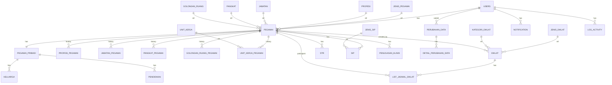

# BE-SIMPEG-RSKALISAT

Backend API Sistem Informasi Kepegawaian RS Kalisat.

## Penjelasan Program

BE-SIMPEG-RSKALISAT dibangun sebagai fondasi digital tata kelola kepegawaian rumah sakit yang sebelumnya tersebar di banyak proses manual, file terpisah, dan alur verifikasi yang lambat. Program ini dirancang supaya data inti seperti identitas pegawai, profile personal, riwayat diklat, notifikasi tindak lanjut, dan pengajuan perubahan data bisa diproses dalam satu layanan backend yang konsisten, terukur, dan aman. Dengan pendekatan ini, tim operasional tidak hanya mendapatkan sistem pencatatan, tetapi juga sistem pengambilan keputusan karena status data, histori perubahan, dan otorisasi per role bisa dilihat secara jelas dari satu sumber kebenaran yang sama.

Manfaat praktisnya adalah proses administrasi menjadi lebih cepat, risiko inkonsistensi data menurun, dan komunikasi antar peran (admin, pegawai, hrd, direktur) menjadi lebih terstruktur melalui kontrak API yang jelas. Secara teknis, implementasi ini merujuk pada praktik backend modern seperti RESTful API design, role-based access control (RBAC), prinsip single responsibility, serta validasi input yang ketat agar lebih tahan terhadap error dan penyalahgunaan request. Referensi pola ini mengikuti praktik umum pada dokumentasi Laravel, OWASP API Security Top 10 untuk aspek keamanan endpoint, serta pendekatan clean layering (controller-service-repository) agar sistem tetap mudah dirawat saat skala fitur dan jumlah pengguna bertambah.

## Arsitektur Coding

Arsitektur yang dipakai adalah pola berlapis agar kode mudah dirawat dan dikembangkan:

1. Controller Layer
	Menangani request/response HTTP, parsing claim JWT, dan standardisasi format JSON output.

2. Service Layer
	Menyimpan business logic utama per domain (`Auth`, `Dashboard`, `Profile`, `ChangeRequest`, `Notification`, `Diklat`).

3. Repository Layer
	Menangani query database agar logic akses data terpusat dan tidak tersebar di controller.

4. Request Validation Layer
	Validasi input dipisah dalam `FormRequest` agar controller tetap tipis.

5. Middleware Layer
	`JwtAuthMiddleware` untuk autentikasi token, `RoleMiddleware` untuk otorisasi role.

6. Database Layer
	Migration + Seeder untuk memastikan skema dan data awal konsisten antar environment.

Alur umum:

Client -> Route -> Middleware -> Controller -> Service -> Repository/Model -> Response JSON

## Cara Jalankan

Prerequisite:

1. PHP 8.3+
2. Composer
3. Database MySQL/MariaDB
4. Node.js (opsional, jika memakai Vite asset build)

Langkah setup:

```bash
composer install
cp .env.example .env
php artisan key:generate
```

Atur koneksi database di `.env`, lalu jalankan:

```bash
php artisan migrate:fresh --seed
php artisan serve
```

Opsional untuk asset frontend:

```bash
npm install
npm run dev
```

URL default API lokal:

`http://127.0.0.1:8000/api`

## Filosofi Kode Backend

THE PHILOSOPHY

Filosofi backend di proyek ini tidak berhenti pada "berjalan" atau "lulus test", tetapi pada bagaimana kode terasa jujur terhadap masalah yang sedang diselesaikan. Kami memandang bahwa arsitektur yang rapi bukan sekadar estetika teknis, melainkan cara menjaga ketenangan tim ketika sistem bertumbuh: controller tetap ringan, service memegang logika bisnis, repository mengelola akses data, dan setiap lapisan bicara dengan tanggung jawab yang jelas. Kejelasan ini membuat developer berikutnya bisa masuk ke codebase tanpa harus menebak-nebak niat penulis sebelumnya. Ada nilai ketertiban di sana, karena software untuk institusi layanan publik harus bisa dipertanggungjawabkan, bukan hanya dipamerkan.

Proyek ini juga dibangun dengan cara pandang bertahap: mulai dari payload dummy untuk mengunci kontrak API, lalu bergerak ke data real tanpa mematahkan integrasi yang sudah berjalan. Dengan begitu, pengembangan tetap pragmatis namun tidak mengorbankan arah jangka panjang. Kami ingin setiap endpoint menyampaikan perilaku yang konsisten, setiap perubahan penting bisa dilacak, dan setiap keputusan teknis mendukung auditability. Dalam konteks SIMPEG, hal ini berarti perubahan profile tidak boleh hilang jejak, notifikasi tidak boleh ambigu, dan perbedaan hak akses harus tegas namun tetap mudah dipahami oleh pengguna.

Pada akhirnya, filosofi ini adalah kombinasi antara disiplin dan empati: disiplin pada struktur kode, empati pada orang yang menggunakan dan merawat sistem. Backend yang baik bukan yang paling kompleks, tetapi yang paling jelas niatnya, paling minim kejutan, dan paling bisa diandalkan saat dibutuhkan. Kami percaya kualitas teknis harus berdampak langsung pada kualitas pelayanan, sehingga sistem ini tidak hanya benar secara program, tetapi juga bermanfaat secara nyata dalam ritme kerja harian.

## Ucapan Syukur

Alhamdulillah, terima kasih kepada Allah SWT atas kemudahan, ilmu, dan kelancaran dalam proses pengembangan sistem ini.

## Lampiran

1. Skema DBML: [dbfix.dbml](dbfix.dbml)
2. Dokumentasi aplikasi: [dokumentasi/dokumentasi_app.md](dokumentasi/dokumentasi_app.md)
3. Dokumentasi API: [dokumentasi/dokumentasi_api.md](dokumentasi/dokumentasi_api.md)

### Diagram Database (Mermaid)

Diagram berikut adalah ringkasan entity relationship utama yang disusun dari skema [dbfix.dbml](dbfix.dbml).


