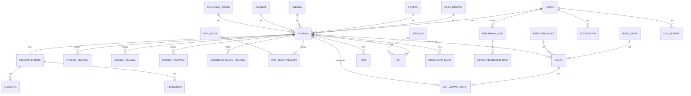

<div align="center">

# 🏥 BE-SIMPEG-RSKALISAT

<a href="https://git.io/typing-svg"></a>


*Backend API Sistem Informasi Kepegawaian RS Kalisat untuk tata kelola data pegawai yang modern dan terpusat.*

</div>

---

## 📖 Penjelasan Program

BE-SIMPEG-RSKALISAT dibangun sebagai fondasi digital tata kelola kepegawaian rumah sakit yang sebelumnya tersebar di banyak proses manual, file terpisah, dan alur verifikasi yang lambat. Program ini dirancang supaya data inti seperti identitas pegawai, profile personal, riwayat diklat, notifikasi tindak lanjut, dan pengajuan perubahan data bisa diproses dalam satu layanan backend yang konsisten, terukur, dan aman.

<details>
<summary><b>✨ Klik untuk melihat Manfaat & Pendekatan Teknis</b></summary>

<br>

**Manfaat Praktis:**
- ⚡ **Lebih Cepat:** Proses administrasi jauh lebih efisien.
- 🛡️ **Lebih Aman:** Risiko inkonsistensi data menurun drastis.
- 🤝 **Komunikasi Terstruktur:** Alur antar peran (admin, pegawai, hrd, direktur) tertata rapi melalui kontrak API.

**Pendekatan Teknis:**
- Implementasi merujuk pada praktik backend modern seperti **RESTful API design**.
- **Role-Based Access Control (RBAC)** untuk keamanan akses.
- Menerapkan prinsip **Single Responsibility** dan pendekatan *clean layering* (Controller-Service-Repository).
- Sesuai standar keamanan **OWASP API Security Top 10**.

</details>

---

## 🧩 Fitur Utama & Modul

Jelajahi berbagai modul interaktif yang disediakan oleh sistem ini:

<details>
<summary><b>🔐 Authentication & Authorization</b></summary>
<br>
Sistem login menggunakan JWT (JSON Web Tokens) dengan pembagian role (Admin, HRD, Direktur, Pegawai). 
Setiap endpoint dilindungi middleware untuk otorisasi akses sesuai kewenangan.
</details>

<details>
<summary><b>👥 Manajemen Pegawai & Profil</b></summary>
<br>
Fungsionalitas lengkap untuk pengelolaan identitas pribadi pegawai, alamat, update profil (dengan sistem <i>Approval / Change Request</i>), dan auto-generate dokumen CV (PDF).
</details>

<details>
<summary><b>📚 Manajemen Diklat</b></summary>
<br>
Pegawai dapat mengajukan pelatihan secara mandiri. HRD memiliki alur tersendiri untuk melakukan <i>Verifikasi Kelayakan</i> sebelum pelatihan dan <i>Validasi Sertifikat</i> sesudah pelatihan, serta membuat jadwal <i>Master Diklat</i>.
</details>

<details>
<summary><b>💼 Riwayat Karir & Keluarga</b></summary>
<br>
Pendataan menyeluruh meliputi:
- Riwayat Pendidikan, Jabatan, Pangkat
- Sertifikasi Profesional: STR & SIP
- Penugasan Klinis
- Data Keluarga lengkap (Pasangan, Anak, Orang Tua, Kontak Darurat)
</details>

---

## 🏛️ Arsitektur Sistem

Arsitektur yang dipakai adalah pola berlapis agar kode mudah dirawat dan dikembangkan.

> **Client ➡️ Route ➡️ Middleware ➡️ Controller ➡️ Service ➡️ Repository/Model ➡️ Response JSON**

<details>
<summary><b>📂 Detail Layering Architecture</b></summary>
<br>

1. **Controller Layer:** Menangani request/response HTTP, parsing claim JWT, dan standardisasi format JSON.
2. **Service Layer:** Menyimpan <i>business logic</i> utama per domain.
3. **Repository Layer:** Menangani <i>query</i> database agar <i>logic</i> terpusat.
4. **Request Validation Layer:** Validasi <i>input</i> dipisah dalam <code>FormRequest</code>.
5. **Middleware Layer:** <code>JwtAuthMiddleware</code> & <code>RoleMiddleware</code>.
6. **Database Layer:** Migration + Seeder untuk konsistensi antar <i>environment</i>.

</details>

### 📊 Diagram Relasi Database (ERD)

<details>
<summary><b>🔍 Tampilkan Diagram Entity Relationship (Mermaid)</b></summary>


```mermaid
erDiagram
	 USERS ||--o{ PEGAWAI : has
	 PEGAWAI ||--|| PEGAWAI_PRIBADI : has
	 PEGAWAI_PRIBADI ||--o{ KELUARGA : has
	 PEGAWAI_PRIBADI ||--o{ PENDIDIKAN : has

	 JENIS_PEGAWAI ||--o{ PEGAWAI : ref
	 PROFESI ||--o{ PEGAWAI : ref
	 JABATAN ||--o{ PEGAWAI : ref
	 PANGKAT ||--o{ PEGAWAI : ref
	 GOLONGAN_RUANG ||--o{ PEGAWAI : ref

	 PEGAWAI ||--o{ PROFESI_PEGAWAI : history
	 PEGAWAI ||--o{ JABATAN_PEGAWAI : history
	 PEGAWAI ||--o{ PANGKAT_PEGAWAI : history
	 PEGAWAI ||--o{ GOLONGAN_RUANG_PEGAWAI : history
	 PEGAWAI ||--o{ UNIT_KERJA_PEGAWAI : history
	 UNIT_KERJA ||--o{ UNIT_KERJA_PEGAWAI : ref

	 JENIS_DIKLAT ||--o{ DIKLAT : ref
	 KATEGORI_DIKLAT ||--o{ DIKLAT : ref
	 PEGAWAI ||--o{ DIKLAT : created_by
	 DIKLAT ||--o{ LIST_JADWAL_DIKLAT : has
	 PEGAWAI ||--o{ LIST_JADWAL_DIKLAT : participant

	 PEGAWAI ||--o{ STR : has
	 PEGAWAI ||--o{ SIP : has
	 JENIS_SIP ||--o{ SIP : ref
	 PEGAWAI ||--o{ PENUGASAN_KLINIS : has

	 USERS ||--o{ NOTIFICATION : has

	 USERS ||--o{ PERUBAHAN_DATA : submit
	 PERUBAHAN_DATA ||--o{ DETAIL_PERUBAHAN_DATA : has

	 USERS ||--o{ LOG_ACTIVITY : has
```
</details>

---

## 🚀 Cara Menjalankan Project (Getting Started)

<details open>
<summary><b>🛠️ Persiapan (Prerequisites)</b></summary>
<br>

- **PHP** 8.3+
- **Composer** v2+
- **Database** MySQL/MariaDB
- **Node.js** (opsional, jika memakai Vite asset build)
</details>

### 🔧 Langkah Instalasi

```bash
# 1. Clone repository
git clone <url-repo-anda>
cd BE-SIMPEG-RSKALISAT

# 2. Install library PHP
composer install

# 3. Setup environment
cp .env.example .env
php artisan key:generate
```

Lakukan konfigurasi koneksi database di file `.env`, lalu eksekusi *migration* & *seeder* untuk data awal:

```bash
php artisan migrate:fresh --seed
php artisan serve
```

🌐 **URL default API lokal:** `http://127.0.0.1:8000/api`

---

## 📝 Dokumentasi & API Testing

Bagi pengembang Frontend atau QA, silakan gunakan tautan di bawah ini untuk mengakses dokumentasi kontrak API beserta *Postman Collection* yang sudah dilengkapi dengan berbagai sekenario testing otomatis (Alur HRD, Diklat, Validasi, Manajemen Karir, dsb).

- 🔗 **Skema DBML:** [dbfix.dbml](dbfix.dbml)
- 🔗 **Dokumentasi Aplikasi Detail:** [dokumentasi/dokumentasi_app.md](dokumentasi/dokumentasi_app.md)
- 🔗 **Dokumentasi API Spesifikasi:** [dokumentasi/dokumentasi_api.md](dokumentasi/dokumentasi_api.md)
- 🚀 **Postman Collection:** `BE-SIMPEG-RSKALISAT.postman_collection.json` (terdapat di folder `dokumentasi/postman/`)

---

## 🧠 Filosofi Kode Backend

> *"Filosofi backend di proyek ini tidak berhenti pada 'berjalan' atau 'lulus test', tetapi pada bagaimana kode terasa jujur terhadap masalah yang sedang diselesaikan."*

Kami memandang bahwa arsitektur yang rapi bukan sekadar estetika teknis, melainkan cara menjaga ketenangan tim ketika sistem bertumbuh. Kejelasan ini membuat developer berikutnya bisa masuk ke codebase tanpa harus menebak-nebak niat penulis sebelumnya. Ada nilai ketertiban di sana, karena **software untuk institusi layanan publik harus bisa dipertanggungjawabkan, bukan hanya dipamerkan.**

Pengembangan bersifat bertahap namun pragmatis. Kami ingin setiap endpoint menyampaikan perilaku yang konsisten, setiap perubahan penting bisa dilacak, dan setiap keputusan teknis mendukung auditability. 

*Backend yang baik bukan yang paling kompleks, tetapi yang paling jelas niatnya, paling minim kejutan, dan paling bisa diandalkan saat dibutuhkan.*

---

## 🙏 Ucapan Syukur
Alhamdulillah, terima kasih kepada Allah SWT atas kemudahan, ilmu, dan kelancaran dalam proses pengembangan sistem ini.

<br>

<div align="center">
<b>Dibuat dengan ❤️ untuk Sistem Informasi RS Kalisat</b>
</div>
