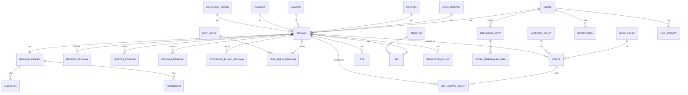

<div align="center">
  

  # BE-SIMPEG-RSKALISAT
  
  **Backend API Sistem Informasi Manajemen Kepegawaian RS Kalisat**

  [](#)
  [](#)
  [](#)
</div>

<br>

BE-SIMPEG-RSKALISAT dibangun sebagai fondasi digital tata kelola kepegawaian rumah sakit. Sistem ini meresentralisasi proses administrasi kepegawaian—seperti manajemen profil, pengelolaan diklat, verifikasi dokumen, dan pembaruan riwayat karir—dalam satu layanan backend berbasis RESTful API yang terstruktur dan aman.

## Dokumentasi Teknis

Dokumentasi proyek ini dipisahkan berdasarkan konteks fungsionalitas dan analisis. Silakan akses masing-masing dokumen berikut untuk melihat detail implementasi:

- [Dokumentasi Aplikasi (App)](dokumentasi/dokumentasi_app.md)
- [Dokumentasi Spesifikasi API](dokumentasi/dokumentasi_api.md)
- [Dokumentasi Skenario Pengujian (Testing)](dokumentasi/dokumentasi_skenario.md)
- [Dokumentasi Gap Analysis](dokumentasi/dokumentasi_gap.md)
- [Skema Database (DBML)](dbfix.dbml)

**Postman Collection:** Terdapat pada direktori `dokumentasi/postman/BE-SIMPEG-RSKALISAT.postman_collection.json` untuk keperluan *end-to-end testing*.

## Fitur Utama

Sistem ini mendukung modul fungsionalitas berikut:
- **Authentication & Authorization**: Implementasi JSON Web Tokens (JWT) dengan *Role-Based Access Control* (Admin, HRD, Direktur, Pegawai).
- **Manajemen Pegawai**: Pengelolaan identitas, alamat, data keluarga, dan persetujuan pembaruan data melalui mekanisme *Change Request*.
- **Manajemen Diklat**: Pengajuan pelatihan mandiri oleh pegawai, verifikasi kelayakan oleh HRD, serta pengelolaan jadwal *Master Diklat*.
- **Riwayat Karir**: Perekaman riwayat pendidik, jabatan, kepangkatan, serta sertifikasi profesional teknis medis seperti STR (Surat Tanda Registrasi), SIP (Surat Izin Praktik), dan Penugasan Klinis.
- **Export Dokumen**: Fitur otomatisasi pembuatan Curriculum Vitae (CV) dalam format PDF berdasarkan rekam medis kepegawaian.

## Arsitektur Sistem

Arsitektur aplikasi menggunakan pola desain *multi-layer* untuk memisahkan tanggung jawab, memudahkan pengujian, dan meminimalisir *coupling*:

`Client -> Route -> Middleware -> Controller -> Service -> Repository/Model -> Response`

1. **Controller Layer**: Menangani HTTP request, standardisasi payload JSON, dan response HTTP.
2. **Service Layer**: Mengenkapsulasi sentralisasi logika bisnis (domain logic).
3. **Repository Layer**: Mengabstraksi interaksi basis data untuk menipiskan lapisan Service.
4. **Validation Layer**: Memanfaatkan `FormRequest` untuk validasi input parameter.
5. **Middleware Layer**: Eksekusi pra-request seperti otentikasi token dan otorisasi hak akses (*Role*).

### Diagram Relasi Database

Diagram Entity-Relationship (ERD) berikut merepresentasikan skema basis data utama. Diagram ini dirender secara natif menggunakan sintaks Mermaid.


```mermaid
erDiagram
    USERS ||--o{ PEGAWAI : has
    PEGAWAI ||--|| PEGAWAI_PRIBADI : has
    PEGAWAI_PRIBADI ||--o{ KELUARGA : has
    PEGAWAI_PRIBADI ||--o{ PENDIDIKAN : has

    JENIS_PEGAWAI ||--o{ PEGAWAI : ref
    PROFESI ||--o{ PEGAWAI : ref
    JABATAN ||--o{ PEGAWAI : ref
    PANGKAT ||--o{ PEGAWAI : ref
    GOLONGAN_RUANG ||--o{ PEGAWAI : ref

    PEGAWAI ||--o{ PROFESI_PEGAWAI : history
    PEGAWAI ||--o{ JABATAN_PEGAWAI : history
    PEGAWAI ||--o{ PANGKAT_PEGAWAI : history
    PEGAWAI ||--o{ GOLONGAN_RUANG_PEGAWAI : history
    PEGAWAI ||--o{ UNIT_KERJA_PEGAWAI : history
    UNIT_KERJA ||--o{ UNIT_KERJA_PEGAWAI : ref

    JENIS_DIKLAT ||--o{ DIKLAT : ref
    KATEGORI_DIKLAT ||--o{ DIKLAT : ref
    PEGAWAI ||--o{ DIKLAT : created_by
    DIKLAT ||--o{ LIST_JADWAL_DIKLAT : has
    PEGAWAI ||--o{ LIST_JADWAL_DIKLAT : participant

    PEGAWAI ||--o{ STR : has
    PEGAWAI ||--o{ SIP : has
    JENIS_SIP ||--o{ SIP : ref
    PEGAWAI ||--o{ PENUGASAN_KLINIS : has

    USERS ||--o{ NOTIFICATION : has
    USERS ||--o{ PERUBAHAN_DATA : submit
    PERUBAHAN_DATA ||--o{ DETAIL_PERUBAHAN_DATA : has
    USERS ||--o{ LOG_ACTIVITY : has
```

## Persiapan Instalasi

Pastikan *environment* server atau perangkat lokal Anda memenuhi prasyarat berikut:
- PHP 8.3+
- Composer
- Database MySQL/MariaDB

### Langkah Deployment / Setup

1. Lakukan *clone* repositori dan *install dependencies*.
   ```bash
   git clone <repository-url>
   cd BE-SIMPEG-RSKALISAT
   composer install
   ```

2. Persiapkan konfigurasi *environment*.
   ```bash
   cp .env.example .env
   php artisan key:generate
   ```

3. Sesuaikan kredensial koneksi database di dalam file `.env`, kemudian eksekusi skema dan *seeder* data awal.
   ```bash
   php artisan migrate:fresh --seed
   php artisan serve
   ```
   API akan siap melayani *request* di `http://127.0.0.1:8000/api`.

## Filosofi Pengembangan

Filosofi backend di proyek ini tidak berhenti pada fungsionalitas yang berjalan, tetapi pada bagaimana kode dirancang untuk mengatasi kompleksitas operasional administratif di sebuah instansi pelayanan medis. Kami memandang bahwa arsitektur yang rapi bukanlah sekadar estetika teknis, melainkan sebuah metode untuk menjaga stabilitas *codebase* jangka panjang. 

Pendekatan *clean architecture* yang diimplementasikan menuntut kedisiplinan agar setiap lapisan kode dieksekusi dengan fungsi yang murni (*single responsibility*). Kualitas struktural ini krusial untuk memenuhi standar keamanan audit (seperti rekam jejak persetujuan profil, pembaruan sertifikasi klinis) serta menjaga skalabilitas beban kerja yang bertambah dari waktu ke waktu.
